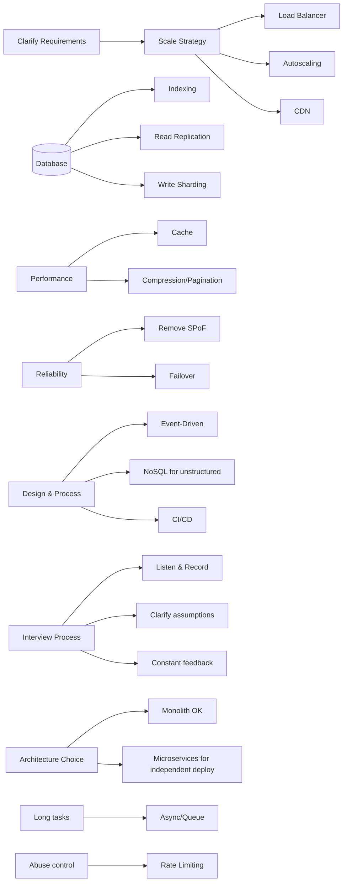

  
# Most Important Tips for System Design Interviews — Tóm tắt nhanh (VN)

  

*Nguồn gốc: System Design Codex — “Most Important Tips for System Design Interviews” (Sep 16, 2025).*

  

> Mục tiêu: tóm tắt **23 nguyên tắc** cốt lõi để xử lý interview system design và áp dụng thực tế. Mỗi mục: 1–2 ý chính + hình minh họa khi có.

  

---

  

## 0) Bức tranh tổng quan

*(Sơ đồ định hướng, không thay thế chi tiết triển khai.)*

  

---

  

## 1) Ưu tiên **Vertical scaling** rồi mới **Horizontal**

- Nâng cấp cấu hình 1 node trước; khi chi phí tăng dần/không hiệu quả → chuyển sang nhân bản ngang.

  

## 2) **Autoscaling** cho traffic spike

- Scale-out theo nhu cầu để tránh over‑provision.

  

## 3) **Load Balancer** cho HA + hiệu suất

- Phân phối request, tăng tính sẵn sàng.

  

## 4) **Cache** cho hệ thống **read‑heavy**

- Không phải silver bullet, nhưng giúp giảm tải DB và “mua thời gian” tối ưu.

  

## 5) **Listen & Record**

- Lắng nghe yêu cầu, ghi chú lại – đây là “siêu năng lực” trong phỏng vấn.

  

## 6) Dùng **CDN** để giảm **latency**

- Phục vụ static gần user; hỗ trợ chống DDoS.

  

## 7) Tạo **index** đúng

- Chiến lược index tốt nhiều khi loại bỏ nhu cầu cache.

  

## 8) **Replication** để scale **reads**

- Primary cho write; read‑replica cho đọc. Cân bằng HA vs consistency.

  

## 9) **Sharding** để scale **writes**

- Chia bảng theo shard‑key → phân tán tải ghi.

  

## 10) **Clarify assumptions**

- Trước khi vào solution, làm rõ giả định & boundary.

  

## 11) **Object Storage** cho dữ liệu phức tạp (video/image/file)

- Tận dụng dịch vụ của cloud provider.

  

## 12) **Rate limiting** để điều tiết usage

- Bảo vệ dịch vụ, chống lạm dụng/DoS.

  

## 13) Loại bỏ **Single Point of Failure**

- Tăng **redundancy** (active‑passive/active‑active/multi‑active) & **isolation** (server→rack→DC→AZ→region).

  

## 14) Đừng quên **Non‑Functional Requirements**

- Ví dụ: SLO latency, số user đồng thời… ảnh hưởng trực tiếp lựa chọn kiến trúc.

  

## 15) **Failover** để tăng fault‑tolerance

- Có cơ chế chuyển đổi khi node chính lỗi.

  

## 16) **Long‑running task** → **Async/Queue**

- Tránh chặn UX; đẩy vào hàng đợi + worker.

  

## 17) **Event‑Driven** để giảm coupling

- Tăng agility, giảm blast radius khi thay đổi.

  

## 18) **NoSQL** cho dữ liệu **unstructured/flexible schema**

- SQL & NoSQL ngày càng giao thoa, nhưng unstructured → NoSQL thường phù hợp.

  

## 19) **Constant feedback** trong buổi phỏng vấn

- Đối thoại 2 chiều, xin feedback liên tục thay vì chờ đến cuối.

  

## 20) **Compression & Pagination**

- Giảm băng thông, tối ưu chuyển dữ liệu lớn.

  

## 21) **CI/CD**

- Tự động build/deploy để tăng velocity và độ tin cậy.

  

## 22) **Microservices** cho **independent deployment**

- Monolith/modular monolith đi rất xa; nhưng cần tách deploy/scale riêng → microservices (đổi lại: độ phức tạp cao).

  

## 23) **Không có câu trả lời hoàn hảo**

- Luôn là bài toán **trade‑off**; quan trọng là lập luận và thích nghi.

  

---

  

### Ghi chú & công lao

- Bài gốc và hình minh họa: *System Design Codex – “Most Important Tips for System Design Interviews” (Saurabh Dashora, 2025-09-16).*

- Link bài gốc: https://newsletter.systemdesigncodex.com/p/most-important-tips-for-system-design