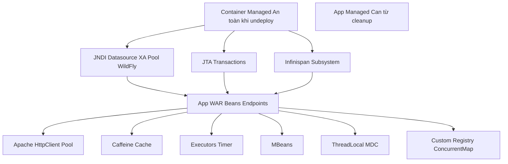

# Quản lý vòng đời trong Servlet

> _Ghi chú kỹ thuật — góc nhìn từ developer vận hành ứng dụng Jakarta EE trên WildFly.  
> Không chỉ là lý thuyết — mà là những gì mình đã debug, crash, redeploy, và học được từ production._

---

## Mô hình tổng quan việc tương tác giữa hệ thống phần cứng và phần mềm

```mermaid
graph TD
  HW[Hardware CPU-RAM-Network-Disk]
  OS[OS Oracle Linux]
  JVM[JVM HotSpot Metaspace Heap Threads]
  WF[WildFly Server Modules Subsystems]
  CLP[Parent ClassLoaders Boot System WildFly Modules]
  CLW[Deployment ClassLoader WAR EAR]
  APP[App WAR Servlets Filters JAXRS Beans]
  HRES[Container Managed Resources - JNDI aka Java Naming and Directory Interface, Datasource, JTA aka Java Transaction API, Infinispan Cache, Elytron Security Domains]
  ARES[App Managed Resources HttpClient Pools Caffeine Cache Executors Registries MBeans ThreadLocals]

  HW --> OS
  OS --> JVM
  JVM --> WF
  WF --> CLP
  CLP --> CLW
  CLW --> APP
  WF --- HRES
  APP --- ARES
  ```
  ## Điểm rò rỉ giữ ClassLoader cũ (Memory Leak khi redeploy)
  ```mermaid
  graph LR

  P[Parent Module CL WildFly Modules]
  R[Global Registry DriverManager JMX Logging Appenders]
  O[Objects Callbacks của WAR cũ]
  CL[App ClassLoader WAR cũ]
  THD[Long lived Threads Executors Timer Netty]
  TL[ThreadLocal MDC Ctx]

  P --- R
  R --- O
  O --- CL
  THD --- CL
  TL --- CL
  ```
  ⚠️ **Cảnh báo thực tế:**  
Không phải cứ tắt server là xong. Trong môi trường dev hoặc staging — mình thường hot-redeploy liên tục. Và chỉ cần **một lần quên dọn dẹp** — là ClassLoader bị treo, metaspace phình to, vài lần sau là `OutOfMemoryError`.

Mình đã từng crash server 3 lần trong 1 ngày chỉ vì một cái `ThreadLocal` không `.remove()`.

### 🔍 Nguyên nhân sâu xa:

- `DriverManager`, `MBeanServer`, `LogManager`... là **static registry** — sống cùng JVM, được load bởi **Parent ClassLoader**.
- Khi WAR đăng ký `Driver`, `MBean`, `Appender`... → các registry này **giữ reference** đến object thuộc về WAR → giữ luôn **Deployment ClassLoader**.
- Khi undeploy — nếu không hủy đăng ký → ClassLoader **không được GC** → memory leak.

### ✅ Giải pháp của mình:

Luôn implement `ServletContextListener` — và coi đây là “trạm dọn dẹp cuối cùng”:

```
@WebListener
public class AppCleanupListener implements ServletContextListener {

    @Override
    public void contextDestroyed(ServletContextEvent sce) {
        // 1. JDBC Driver
        deregisterJDBCDrivers();

        // 2. MBeans
        unregisterMBeans();

        // 3. ThreadLocal
        ThreadLocalCleaner.clearAll();

        // 4. Executors, Timer, Cache...
        shutdownPoolsAndCaches();
    }

    private void deregisterJDBCDrivers() {
        Enumeration<Driver> drivers = DriverManager.getDrivers();
        while (drivers.hasMoreElements()) {
            Driver driver = drivers.nextElement();
            if (driver.getClass().getClassLoader() == getClass().getClassLoader()) {
                try {
                    DriverManager.deregisterDriver(driver);
                    System.out.println("Deregistered JDBC driver: " + driver);
                } catch (SQLException e) {
                    e.printStackTrace();
                }
            }
        }
    }

    private void unregisterMBeans() {
        MBeanServer mbs = ManagementFactory.getPlatformMBeanServer();
        try {
            Set<ObjectName> names = mbs.queryNames(new ObjectName("myapp:*"), null);
            for (ObjectName name : names) {
                mbs.unregisterMBean(name);
                System.out.println("Unregistered MBean: " + name);
            }
        } catch (Exception e) {
            e.printStackTrace();
        }
    }

    // Có thể mở rộng thêm các phương thức dọn dẹp khác tùy project
}
```
→ **Quy tắc bất di bất dịch:**

> _“Cái gì do WAR tạo ra và gắn vào thứ gì đó sống lâu hơn WAR — thì phải tự tay gỡ ra khi undeploy.”_

## Vị trí và vòng đời tài nguyên


### 💡 Phân biệt rõ ràng: HRES vs ARES

|Loại tài nguyên|Do ai quản lý|Vòng đời|Trách nhiệm dọn dẹp|
|---|---|---|---|
|**HRES**(Container Managed)|WildFly|Cùng server|❌ Không cần — WildFly lo|
|**ARES**(App Managed)|Ứng dụng (mình)|Cùng WAR|✅**BẮT BUỘC phải dọn trong `contextDestroyed()`**|

> 🧠 **Bài học xương máu:**  
> Mình từng nghĩ: “Thôi kệ, để đó — redeploy vài lần có sao đâu, restart cái là xong.”  
> → Cho đến khi hệ thống production crash giữa đêm vì `Metaspace OOM` — không thể restart nóng — phải downtime 15 phút.
> 
> Từ đó, mình coi `contextDestroyed()` là **nghi thức bắt buộc** — như `finally` block vậy — không được phép bỏ qua.

---

## 🔄 Câu hỏi thường gặp (và câu trả lời mình đúc kết)

### ❓ “Dừng WildFly bằng `systemctl stop` có giải phóng leak không?”

→ **Có.** JVM tắt → mọi thứ bay màu. Nhưng đó là **giải pháp cuối cùng** — không phải cách vận hành chuyên nghiệp.

### ❓ “Chỉ cần dùng thư viện chuẩn là không leak?”

→ **Sai.** Ngay cả code của mình — một `static List<LeakServlet>` — cũng có thể gây leak nếu không dọn. Thư viện bên thứ ba càng nguy hiểm hơn.

### ❓ “Có cách nào tự động hóa không?”

→ Có — nhưng phải chủ động:

- Bật `enable-leak-detection` trong WildFly → bắt lỗi sớm.
- Viết integration test giả lập redeploy → kiểm tra GC.
- Dùng `@PreDestroy` nếu dùng CDI.
- Tạo `ResourceRegistry` tập trung — bắt buộc đăng ký cleanup task.

---

## ✅ Checklist trước khi deploy (của riêng mình)

- Đã implement `ServletContextListener`?
- Đã deregister JDBC driver?
- Đã unregister MBean?
- Đã shutdown `ExecutorService`, `Timer`?
- Đã `.remove()` mọi `ThreadLocal`?
- Đã clear cache toàn cục do app tạo?
- Đã remove mọi listener/callback đăng ký vào global service?
- Đã bật leak detection trong WildFly để cảnh báo dev?

> 🚀 **Tư duy của mình bây giờ:**  
> _“Release tài nguyên không phải là phần phụ — mà là một phần không thể tách rời của việc khởi tạo. Không dọn — coi như chưa xong.”_

---

## 📌 Ghi chú cuối

> File này không chỉ là tài liệu — mà là **nhật ký kỹ thuật** của mình. Mỗi dòng ghi lại một lần crash, một lần debug, một lần học được từ production.
> 
> Hy vọng nó giúp bạn — hoặc chính mình trong tương lai — tránh được những cái bẫy mà mình đã từng sa vào.