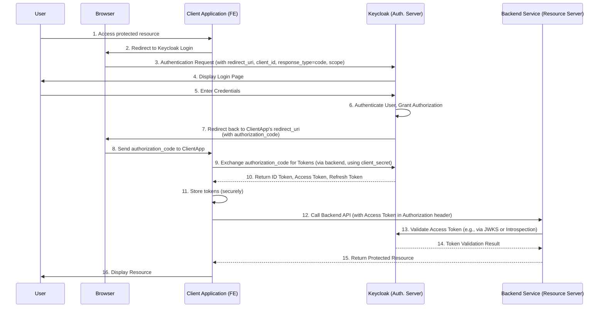
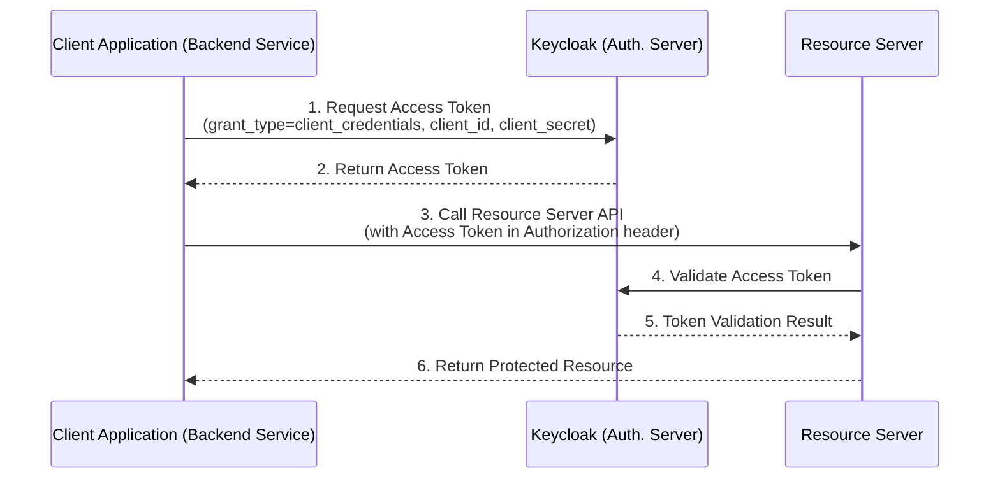

# 🔑 Keycloak In-Depth Analysis & System Design Guide

---
## 📋 Table of Contents

- **1.** [Giới thiệu Keycloak](#1-giới-thiệu-keycloak)
- **2.** [Vấn đề mà Keycloak giải quyết: Phân mảnh ID & Auth](#2-vấn-đề-mà-keycloak-giải-quyết-phân-mảnh-id--auth)
- **3.** [Keycloak là gì?](#3-keycloak-là-gì)
- **4.** [Các Khái niệm cốt lõi](#4-các-khái-niệm-cốt-lõi)
    - **4.1** [Identity and Access Management (IAM)](#41-identity-and-access-management-iam)
    - **4.2** [Single Sign-On (SSO)](#42-single-sign-on-sso)
    - **4.3** [OpenID Connect (OIDC)](#43-openid-connect-oidc)
    - **4.4** [OAuth 2.0](#44-oauth-20)
    - **4.5** [SAML 2.0](#45-saml-20)
    - **4.6** [Realm](#46-realm)
    - **4.7** [Client](#47-client)
    - **4.8** [User](#48-user)
    - **4.9** [Role & Group](#49-role--group)
- **5.** [Kiến trúc Keycloak](#5-kiến-trúc-keycloak)
- **6.** [Các Flow OAuth 2.0/OIDC phổ biến với Keycloak](#6-các-flow-oauth-20oidc-phổ-biến-với-keycloak)
    - **6.1** [Authorization Code Flow (Recommended)](#61-authorization-code-flow-recommended)
    - **6.2** [Client Credentials Flow](#62-client-credentials-flow)
- **7.** [Cài đặt và Cấu hình cơ bản](#7-cài-đặt-và-cấu-hình-cơ-bản)
    - **7.1** [Cài đặt bằng Docker](#71-cài-đặt-bằng-docker)
    - **7.2** [Truy cập Admin Console](#72-truy-cập-admin-console)
    - **7.3** [Tạo Realm, Client, User](#73-tạo-realm-client-user)
- **8.** [Tích hợp với Ứng dụng (Client Integration)](#8-tích-hợp-với-ứng-dụng-client-integration)
    - **8.1** [Ví dụ: Spring Boot OAuth2 Client](#81-ví-dụ-spring-boot-oauth2-client)
- **9.** [Keycloak trong System Design](#9-keycloak-trong-system-design)
    - **9.1** [Khi nào nên dùng Keycloak?](#91-khi-nào-nên-dùng-keycloak)
    - **9.2** [Ưu điểm](#92-ưu-điểm)
    - **9.3** [Nhược điểm & Thách thức](#93-nhược-điểm--thách-thức)
    - **9.4** [Considerations khi triển khai](#94-considerations-khi-triển-khai)
- **10.** [So sánh với các giải pháp khác](#10-so-sánh-với-các-giải-pháp-khác)
    - **10.1** [Keycloak vs. Auth0/Okta (SaaS)](#101-keycloak-vs-auth0okta-saas)
    - **10.2** [Keycloak vs. Tự xây dựng (Build-Your-Own)](#102-keycloak-vs-tự-xây-dựng-build-your-own)
- **11.** [Kết luận & Next Steps](#11-kết-luận--next-steps)

---

## 1. Giới thiệu Keycloak

Trong kỷ nguyên của các ứng dụng phân tán, microservices, và hệ thống đa nền tảng, việc quản lý danh tính (Identity Management) và kiểm soát quyền truy cập (Access Control) trở nên cực kỳ phức tạp. Làm sao để người dùng chỉ cần đăng nhập một lần là có thể truy cập nhiều ứng dụng khác nhau? Làm sao để quản lý hàng trăm, hàng ngàn người dùng và gán quyền cho họ một cách hiệu quả? Keycloak chính là câu trả lời cho những thách thức này.

---

## 2. Vấn đề mà Keycloak giải quyết: Phân mảnh ID & Auth

Trước khi có các giải pháp như Keycloak, mỗi ứng dụng thường tự xây dựng hệ thống đăng ký, đăng nhập và quản lý người dùng riêng. Điều này dẫn đến:

- **Trải nghiệm người dùng kém:** Phải đăng nhập lại ở mỗi ứng dụng.
- **Bảo mật yếu:** Mỗi ứng dụng phải tự xử lý password hashing, session management, dễ phát sinh lỗi bảo mật.
- **Chi phí phát triển cao:** Lặp lại công việc xây dựng tính năng xác thực/ủy quyền ở nhiều nơi.
- **Khó quản lý:** Không có cái nhìn tập trung về người dùng và quyền của họ trên toàn hệ thống.
- **Khó tích hợp bên thứ ba:** Nếu muốn đăng nhập bằng Google, Facebook, mỗi ứng dụng lại phải tự tích hợp.

Keycloak tập trung hóa quá trình xác thực và ủy quyền, giải quyết tất cả các vấn đề trên.

---

## 3. Keycloak là gì?

Keycloak là một **mã nguồn mở (open-source) Identity and Access Management (IAM) solution** của Red Hat. Nó cung cấp các tính năng quản lý danh tính và truy cập tập trung, bao gồm:

- **Single Sign-On (SSO):** Người dùng đăng nhập một lần, truy cập nhiều ứng dụng.
- **Standard Protocols Support:** Hỗ trợ các chuẩn công nghiệp như OpenID Connect (OIDC), OAuth 2.0, và SAML 2.0.
- **User Federation:** Tích hợp với các hệ thống quản lý danh tính hiện có (LDAP, Active Directory).
- **Social Login:** Cho phép người dùng đăng nhập bằng các tài khoản mạng xã hội (Google, Facebook, GitHub...).
- **Mã hóa & Hash:** Tự động xử lý bảo mật cho mật khẩu và token.
- **Admin Console & Account Management:** Giao diện web trực quan để quản lý người dùng, client, realm, và cấu hình.
- **Role-Based Access Control (RBAC):** Quản lý quyền dựa trên vai trò.

> **Expert Note:** Keycloak hoạt động như một **Identity Provider (IdP)** hoặc **Authorization Server**. Nó chịu trách nhiệm xác thực người dùng, cấp phát token (ID Token, Access Token, Refresh Token), và quản lý phiên. Các ứng dụng của bạn (Service Providers/Resource Servers) sẽ ủy thác việc xác thực cho Keycloak.

---

## 4. Các Khái niệm cốt lõi

### 4.1 Identity and Access Management (IAM)

Một hệ thống quản lý các danh tính điện tử (ví dụ: người dùng, ứng dụng) và kiểm soát những gì họ được phép truy cập (quyền). Keycloak là một nền tảng IAM.

### 4.2 Single Sign-On (SSO)

Cho phép người dùng xác thực một lần và truy cập nhiều ứng dụng khác nhau mà không cần đăng nhập lại. Keycloak làm điều này bằng cách quản lý một phiên đăng nhập tập trung.

### 4.3 OpenID Connect (OIDC)

Một lớp (layer) được xây dựng trên OAuth 2.0, cho phép các Client xác minh danh tính của người dùng và nhận thông tin cơ bản về profile của người dùng thông qua **ID Token** (một JWT). OIDC là chuẩn được khuyến nghị cho các trường hợp xác thực người dùng.

### 4.4 OAuth 2.0

Một framework ủy quyền, cho phép một ứng dụng truy cập tài nguyên được bảo vệ trên một Resource Server thay mặt cho một người dùng, mà không cần biết mật khẩu của người dùng đó. OAuth 2.0 định nghĩa các "grant types" (flows) để cấp phát **Access Token**. OAuth 2.0 **không phải là xác thực** người dùng, nó chỉ là **ủy quyền** truy cập tài nguyên.

### 4.5 SAML 2.0

Security Assertion Markup Language (SAML) là một chuẩn XML để trao đổi dữ liệu xác thực và ủy quyền giữa Identity Provider và Service Provider. Thường được sử dụng trong môi trường Enterprise, đặc biệt là tích hợp với các hệ thống cũ.

### 4.6 Realm

Trong Keycloak, một `Realm` là một không gian độc lập để quản lý một tập hợp người dùng, ứng dụng (clients), vai trò và cấu hình bảo mật. Mỗi realm hoàn toàn biệt lập với các realm khác.

> - **Expert Note:** Bạn có thể tạo nhiều realms cho các mục đích khác nhau, ví dụ: một realm cho khách hàng (external users), một realm cho nhân viên nội bộ (internal users), hoặc các realm riêng biệt cho các môi trường (dev, staging, prod) nếu bạn không muốn chia sẻ cấu hình. `master` realm là realm mặc định để quản lý Keycloak.

### 4.7 Client

Một `Client` trong Keycloak là bất kỳ ứng dụng hoặc dịch vụ nào muốn được Keycloak bảo vệ. Đó có thể là một ứng dụng web (frontend), một dịch vụ backend (microservice), hoặc một ứng dụng di động. Mỗi client có ID riêng và cấu hình bảo mật.

> - **Expert Note:** Khi tạo client, bạn cần chọn `Client type` phù hợp:
>   - **OpenID Connect:** Phổ biến nhất cho ứng dụng web/mobile.
>     - `public`: Dành cho các ứng dụng không giữ bí mật (frontend JavaScript, mobile apps).
>     - `confidential`: Dành cho các ứng dụng có thể giữ bí mật (backend services, web server-side rendering apps).
>   - **SAML:** Cho các tích hợp SAML.

### 4.8 User

Là các tài khoản người dùng được Keycloak quản lý. Mỗi user có thể thuộc về các nhóm (groups) và có các vai trò (roles) được gán.

### 4.9 Role & Group

- **Role (Vai trò):** Là một tập hợp các quyền. Bạn gán vai trò cho người dùng hoặc cho các token được cấp cho client.
  - `Realm Roles`: Vai trò toàn cục trong một realm.
  - `Client Roles`: Vai trò cụ thể cho một client (ứng dụng).
- **Group (Nhóm):** Là một tập hợp người dùng. Bạn có thể gán vai trò cho một nhóm, và tất cả người dùng trong nhóm đó sẽ kế thừa các vai trò đó.
> - **Expert Note:** Sử dụng kết hợp Group và Role để quản lý quyền truy cập một cách hiệu quả và dễ mở rộng. Tránh gán vai trò trực tiếp cho từng người dùng riêng lẻ khi số lượng người dùng lớn.

---

## 5. Kiến trúc Keycloak

Keycloak chạy trên một server Java (WildFly/Quarkus) và thường được triển khai dưới dạng một tập hợp các services.

```mermaid
graph TD
    subgraph Frontend Applications
        WebApp[Web Application] -- OAuth 2.0/OIDC --> Keycloak
        SPA[SPA/Mobile App] -- OAuth 2.0/OIDC --> Keycloak
    end

    subgraph Backend Services (Resource Servers)
        BackendService1[Microservice A] --> TokenValidation[Token Validation]
        BackendService2[Microservice B] --> TokenValidation
    end

    subgraph Keycloak Server
        Keycloak[Keycloak Server] -- Auth, Token Issuance --> UserStore[User Storage (DB)]
        Keycloak -- User Federation --> LDAP[LDAP/AD]
        Keycloak -- Social Login --> Google[Google/Facebook]
    end

    TokenValidation -- Token Introspection / JWKS --> Keycloak
    UserStore -- Persistent Data --> Database(PostgreSQL/MySQL)

    style UserStore fill:#f9f,stroke:#333,stroke-width:2px
    style Database fill:#fcb,stroke:#333,stroke-width:2px
```
_Sơ đồ kiến trúc tổng quan của Keycloak trong hệ thống._

**Giải thích:**

- **Keycloak Server:** Là trung tâm xử lý xác thực và ủy quyền.
- **User Storage:** Keycloak lưu trữ thông tin người dùng trong cơ sở dữ liệu nội bộ (mặc định là H2, nhưng nên dùng PostgreSQL/MySQL/MariaDB cho production). Nó cũng có thể tích hợp với các hệ thống quản lý người dùng hiện có như LDAP hoặc Active Directory thông qua tính năng User Federation.
- **Client Applications (Frontend):** Các ứng dụng web, SPA, mobile app sẽ chuyển hướng người dùng đến Keycloak để xác thực. Sau khi xác thực thành công, Keycloak sẽ trả về các token (ID Token, Access Token, Refresh Token) cho ứng dụng.
- **Backend Services (Resource Servers):** Các microservices hoặc API backend sẽ nhận Access Token từ client và cần xác minh tính hợp lệ của token đó. Việc này thường được thực hiện bằng cách kiểm tra chữ ký của JWT (sử dụng JWKS - JSON Web Key Set từ Keycloak) hoặc bằng cách gọi API Introspection của Keycloak. Sau khi token được xác minh, backend có thể sử dụng thông tin trong token (ví dụ: vai trò của người dùng) để thực hiện ủy quyền.

---

## 6. Các Flow OAuth 2.0/OIDC phổ biến với Keycloak

### 6.1 Authorization Code Flow (Recommended)

Đây là flow an toàn và được khuyến nghị nhất cho các ứng dụng web và ứng dụng di động. Nó đảm bảo rằng Access Token không bao giờ được lộ ra trong URL hoặc trong trình duyệt.


_Sơ đồ luồng Authorization Code Flow với Keycloak._

### 6.2 Client Credentials Flow

Flow này được sử dụng khi một ứng dụng (client) cần truy cập tài nguyên được bảo vệ mà không có sự tham gia của người dùng cuối. Thường dùng cho giao tiếp server-to-server.


_Sơ đồ luồng Client Credentials Flow với Keycloak._

---

## 7. Cài đặt và Cấu hình cơ bản

Keycloak có thể được cài đặt trên nhiều nền tảng (standalone, Docker, Kubernetes). Cách dễ nhất để bắt đầu là dùng Docker.

### 7.1 Cài đặt bằng Docker

1.  **Chạy Keycloak Container:**
    ```bash
    docker run -p 8080:8080 -e KEYCLOAK_ADMIN=admin -e KEYCLOAK_ADMIN_PASSWORD=admin --name keycloak-server quay.io/keycloak/keycloak:24.0.5 start-dev
    ```
    - `-p 8080:8080`: Map port 8080 của container ra port 8080 của host.
    - `-e KEYCLOAK_ADMIN=admin`: Đặt username cho tài khoản admin console.
    - `-e KEYCLOAK_ADMIN_PASSWORD=admin`: Đặt mật khẩu cho tài khoản admin console.
    - `quay.io/keycloak/keycloak:24.0.5`: Image Keycloak (nên dùng phiên bản ổn định mới nhất).
    - `start-dev`: Khởi động ở chế độ phát triển (không yêu cầu HTTPS, dễ cấu hình hơn cho dev).

2.  **Chờ Keycloak khởi động:** Quá trình này có thể mất vài phút.

### 7.2 Truy cập Admin Console

Mở trình duyệt và truy cập: `http://localhost:8080/admin/`

Đăng nhập bằng tài khoản `admin/admin` bạn đã tạo ở trên.

### 7.3 Tạo Realm, Client, User

1.  **Tạo Realm mới:**
    - Trong Admin Console, di chuột qua `Master` ở góc trên cùng bên trái, chọn `Create Realm`.
    - Nhập `Name` (ví dụ: `my-app-realm`), sau đó click `Create`.
2.  **Tạo Client mới:**
    - Trong `my-app-realm`, chọn `Clients` ở menu bên trái.
    - Click `Create client`.
    - Nhập `Client ID` (ví dụ: `frontend-app`).
    - Click `Next`.
    - Chọn `Client authentication` (On/Off - tùy thuộc vào loại ứng dụng), `Authorization` (On/Off).
    - `Standard flow enabled`: **On** (để dùng Authorization Code Flow).
    - `Valid redirect URIs`: Nhập `http://localhost:8081/*` (thay bằng URI của ứng dụng frontend của bạn, ví dụ: `http://localhost:3000/*` cho React app, `http://localhost:8081/login/oauth2/code/keycloak` cho Spring Boot).
    - `Web origins`: Nhập `http://localhost:8081` hoặc `*` (để đơn giản trong dev, nhưng nên chỉ định rõ trong prod).
    - Click `Save`.
    - Sau khi tạo client, vào tab `Credentials` của client đó (nếu `Client authentication` là On) để lấy `Client Secret`. Đây là bí mật của client và không được để lộ ra ngoài.
3.  **Tạo User mới:**
    - Trong `my-app-realm`, chọn `Users` ở menu bên trái.
    - Click `Create new user`.
    - Nhập `Username` (ví dụ: `testuser`), các thông tin khác (Email, First Name, Last Name) là tùy chọn.
    - Click `Create`.
    - Vào tab `Credentials` của user vừa tạo.
    - Set `Password` và tắt `Temporary` nếu bạn không muốn user phải đổi mật khẩu khi đăng nhập lần đầu.
    - Click `Set password`.

---

## 8. Tích hợp với Ứng dụng (Client Integration)

Tích hợp ứng dụng của bạn với Keycloak thường liên quan đến việc cấu hình OAuth 2.0/OIDC.

### 8.1 Ví dụ: Spring Boot OAuth2 Client

Đây là ví dụ cấu hình Spring Boot làm một OAuth2 Client để xác thực với Keycloak.

**Dependencies (`pom.xml`):**
```xml
<dependency>
    <groupId>org.springframework.boot</groupId>
    <artifactId>spring-boot-starter-oauth2-client</artifactId>
</dependency>
<dependency>
    <groupId>org.springframework.boot</groupId>
    <artifactId>spring-boot-starter-web</artifactId>
</dependency>
<dependency>
    <groupId>org.springframework.boot</groupId>
    <artifactId>spring-boot-starter-security</artifactId>
</dependency>
```

**`application.yml`:**
```yaml
spring:
  security:
    oauth2:
      client:
        registration:
          keycloak:
            client-id: frontend-app # Tên Client ID bạn tạo trong Keycloak
            client-secret: YOUR_CLIENT_SECRET # Client Secret của client confidential (nếu có)
            authorization-grant-type: authorization_code # Sử dụng Authorization Code Flow
            redirect-uri: "{baseUrl}/login/oauth2/code/keycloak" # URI mà Keycloak sẽ redirect về
            scope: openid, profile, email # Các scope yêu cầu từ Keycloak
        provider:
          keycloak:
            issuer-uri: http://localhost:8080/realms/my-app-realm # URI của realm Keycloak
            user-name-attribute: preferred_username # Tên attribute trong ID Token/User Info để lấy username
  web:
    resources:
      add-mappings: false # Tắt mapping tài nguyên mặc định của Spring Boot
server:
  port: 8081 # Port của ứng dụng Spring Boot
```

**`SecurityConfig.java`:**
```java
import org.springframework.context.annotation.Bean;
import org.springframework.context.annotation.Configuration;
import org.springframework.security.config.annotation.web.builders.HttpSecurity;
import org.springframework.security.config.annotation.web.configuration.EnableWebSecurity;
import org.springframework.security.web.SecurityFilterChain;

@Configuration
@EnableWebSecurity
public class SecurityConfig {

    @Bean
    public SecurityFilterChain securityFilterChain(HttpSecurity http) throws Exception {
        http
            .authorizeHttpRequests(authorize -> authorize
                .requestMatchers("/").permitAll() // Cho phép truy cập trang chủ mà không cần xác thực
                .anyRequest().authenticated() // Tất cả các request khác yêu cầu xác thực
            )
            .oauth2Login(oauth2 -> oauth2
                .defaultSuccessUrl("/secured") // Chuyển hướng sau khi đăng nhập thành công
            )
            .logout(logout -> logout
                .logoutSuccessUrl("/") // Chuyển hướng sau khi đăng xuất
            );
        return http.build();
    }
}
```

**Simple Controller:**
```java
import org.springframework.security.core.annotation.AuthenticationPrincipal;
import org.springframework.security.oauth2.core.user.OAuth2User;
import org.springframework.stereotype.Controller;
import org.springframework.ui.Model;
import org.springframework.web.bind.annotation.GetMapping;

@Controller
public class HomeController {

    @GetMapping("/")
    public String publicPage() {
        return "public-page"; // Một trang HTML công khai
    }

    @GetMapping("/secured")
    public String securedPage(@AuthenticationPrincipal OAuth2User oauth2User, Model model) {
        if (oauth2User != null) {
            // Lấy thông tin từ OAuth2User (được cung cấp bởi ID Token / UserInfo Endpoint)
            model.addAttribute("username", oauth2User.getAttribute("preferred_username"));
            model.addAttribute("name", oauth2User.getAttribute("name"));
            model.addAttribute("email", oauth2User.getAttribute("email"));
            // Bạn có thể lấy thêm các thuộc tính khác tùy theo scope yêu cầu
        }
        return "secured-page"; // Một trang HTML yêu cầu xác thực
    }
}
```

> **Expert Note:** Đối với ứng dụng frontend JavaScript (React, Angular, Vue), bạn sẽ sử dụng thư viện OIDC client bên phía JS (ví dụ: `oidc-client-js`, `@react-keycloak/web`) để xử lý các luồng đăng nhập và quản lý token.

---

## 9. Keycloak trong System Design

### 9.1 Khi nào nên dùng Keycloak?

- **Hệ thống có nhiều ứng dụng:** Cần SSO cho web, mobile, và/hoặc backend services.
- **Yêu cầu quản lý người dùng tập trung:** Cần một nơi duy nhất để quản lý user, role, group.
- **Cần tích hợp Identity Providers bên ngoài:** Cho phép đăng nhập bằng Google, Facebook, LinkedIn, hoặc các IdP doanh nghiệp (LDAP, Active Directory).
- **Yêu cầu bảo mật cao:** Keycloak tuân thủ các chuẩn công nghiệp và được phát triển bởi Red Hat.
- **Cần kiểm soát quyền truy cập linh hoạt:** RBAC, Group-based access.
- **Muốn một giải pháp Open Source/On-premise:** Bạn có thể tự host và tùy chỉnh Keycloak.

### 9.2 Ưu điểm

- **Mã nguồn mở & Miễn phí:** Không tốn chi phí license, có thể tùy chỉnh.
- **Hỗ trợ chuẩn công nghiệp:** OIDC, OAuth 2.0, SAML 2.0, SCIM.
- **Đa dạng tính năng:** SSO, Social Login, User Federation, MFA (Multi-Factor Authentication), Account Management, Admin Console.
- **Dễ triển khai:** Có thể chạy bằng Docker, Kubernetes.
- **Cộng đồng lớn:** Dễ tìm hỗ trợ và tài liệu.
- **Khả năng mở rộng (Scalability):** Hỗ trợ clustering và hoạt động với Load Balancer.

### 9.3 Nhược điểm & Thách thức

- **Độ phức tạp ban đầu:** Thiết lập và cấu hình Keycloak có thể tốn thời gian cho người mới.
- **Yêu cầu tài nguyên:** Là một ứng dụng Java, Keycloak cần một lượng RAM và CPU nhất định, đặc biệt trong môi trường production.
- **Chi phí vận hành (Ops):** Tự vận hành (self-hosting) Keycloak yêu cầu kiến thức về quản lý server, database, và bảo mật. So với các dịch vụ SaaS, chi phí vận hành có thể cao hơn.
- **Nâng cấp:** Nâng cấp các phiên bản lớn của Keycloak có thể phức tạp.
- **Tùy chỉnh sâu:** Nếu bạn cần tùy chỉnh quá sâu vào luồng xác thực hoặc giao diện người dùng, có thể phải phát triển các Service Provider Interface (SPI) plugin, điều này đòi hỏi kiến thức Java và Keycloak internals.

### 9.4 Considerations khi triển khai

- **Database:** Luôn sử dụng một cơ sở dữ liệu mạnh mẽ, bền vững (PostgreSQL, MySQL) thay vì H2 mặc định cho production.
- **Caching:** Cấu hình cache cho Keycloak rất quan trọng để đạt hiệu suất cao, đặc biệt trong môi trường cluster.
- **High Availability (HA):** Triển khai Keycloak trong chế độ cluster với nhiều node và phía sau một Load Balancer để đảm bảo tính sẵn sàng cao.
- **HTTPS:** Luôn sử dụng HTTPS cho tất cả các giao tiếp với Keycloak trong môi trường production.
- **Logging & Monitoring:** Thiết lập logging và monitoring đầy đủ để theo dõi hiệu suất và phát hiện các vấn đề bảo mật/vận hành.
- **Backup & Restore:** Có chiến lược backup database của Keycloak.
- **Eviction:** Thiết lập các policy eviction cho cache để tránh tràn bộ nhớ.
- **Key Rotation:** Có chiến lược xoay vòng các khóa ký (signing keys) của Keycloak định kỳ để tăng cường bảo mật.

---

## 10. So sánh với các giải pháp khác

### 10.1 Keycloak vs. Auth0/Okta (SaaS)

- **Keycloak (On-premise/Open Source):**
  - **Ưu điểm:** Hoàn toàn kiểm soát dữ liệu, miễn phí license, tùy chỉnh sâu, phù hợp với các yêu cầu về tuân thủ (compliance) nghiêm ngặt.
  - **Nhược điểm:** Tự quản lý và vận hành (Ops overhead), cần nguồn lực nội bộ.
- **Auth0/Okta (SaaS):**
  - **Ưu điểm:** Managed service (không lo Ops), dễ dàng tích hợp, hỗ trợ nhanh chóng, nhiều tính năng "out-of-the-box".
  - **Nhược điểm:** Chi phí dựa trên số lượng người dùng/Monthly Active Users (MAU), ít kiểm soát hơn về hạ tầng/dữ liệu, khó tùy chỉnh sâu theo ý muốn.

> **Lời khuyên Tech Lead:** Nếu bạn có nguồn lực vận hành và yêu cầu kiểm soát tuyệt đối hoặc tuân thủ các quy định nghiêm ngặt, Keycloak là lựa chọn tốt. Nếu bạn muốn nhanh chóng triển khai, giảm gánh nặng vận hành và sẵn sàng trả phí, các dịch vụ SaaS là ưu tiên.

### 10.2 Keycloak vs. Tự xây dựng (Build-Your-Own)

- **Keycloak:**
  - **Ưu điểm:** Dựa trên các chuẩn công nghiệp đã được kiểm chứng, giải quyết hầu hết các thách thức về bảo mật và tính năng xác thực/ủy quyền.
  - **Nhược điểm:** Vẫn cần học và cấu hình.
- **Tự xây dựng:**
  - **Ưu điểm:** Hoàn toàn tùy chỉnh, không có dependency bên ngoài.
  - **Nhược điểm:** **Rủi ro cực kỳ cao về bảo mật và chi phí:** Rất khó để xây dựng một hệ thống xác thực an toàn, tuân thủ tất cả các chuẩn và xử lý các kịch bản tấn công. Sẽ mất rất nhiều thời gian và công sức để maintain.

> **Lời khuyên Tech Lead:** **Tuyệt đối không nên tự xây dựng hệ thống xác thực từ đầu** trừ khi bạn là một công ty bảo mật với đội ngũ chuyên gia rất mạnh và có lý do rất đặc biệt. Luôn sử dụng các giải pháp đã được kiểm chứng như Keycloak hoặc các dịch vụ SaaS.

---

## 11. Kết luận & Next Steps

- **Bạn đã:** Có cái nhìn tổng quan về Keycloak, hiểu các khái niệm cốt lõi (IAM, SSO, OIDC, OAuth2, SAML), kiến trúc, các luồng xác thực phổ biến, cách cài đặt cơ bản, và cách tích hợp với ứng dụng Spring Boot. Đặc biệt là các đánh giá và lời khuyên từ góc độ System Design.
- **Lời khuyên của Tech Lead:** Keycloak là một công cụ mạnh mẽ giúp đơn giản hóa và bảo mật hệ thống xác thực/ủy quyền trong các ứng dụng hiện đại. Tuy nhiên, việc triển khai và vận hành nó đòi hỏi sự hiểu biết nhất định về các chuẩn bảo mật và quản lý hệ thống.
- **Nên thử (Next Steps):**
  1. **Thử nghiệm các loại Client khác:** Tích hợp một ứng dụng SPA (React/Angular/Vue) với Keycloak sử dụng các thư viện OIDC client phía frontend.
  2. **Khám phá User Federation:** Cấu hình Keycloak để kết nối với một máy chủ LDAP/Active Directory giả lập.
  3. **Triển khai Keycloak Cluster:** Thiết lập một Keycloak cluster trên Kubernetes hoặc Docker Compose để hiểu về tính sẵn sàng cao và khả năng mở rộng.
  4. **Tìm hiểu về Admin REST API:** Keycloak cung cấp một REST API mạnh mẽ để tự động hóa việc quản lý realm, client, user.
  5. **Nghiên cứu về Authorization Services:** Keycloak không chỉ là xác thực, nó còn có một module ủy quyền mạnh mẽ dựa trên Policy-Based Access Control (PBAC) cho các kịch bản phức tạp.