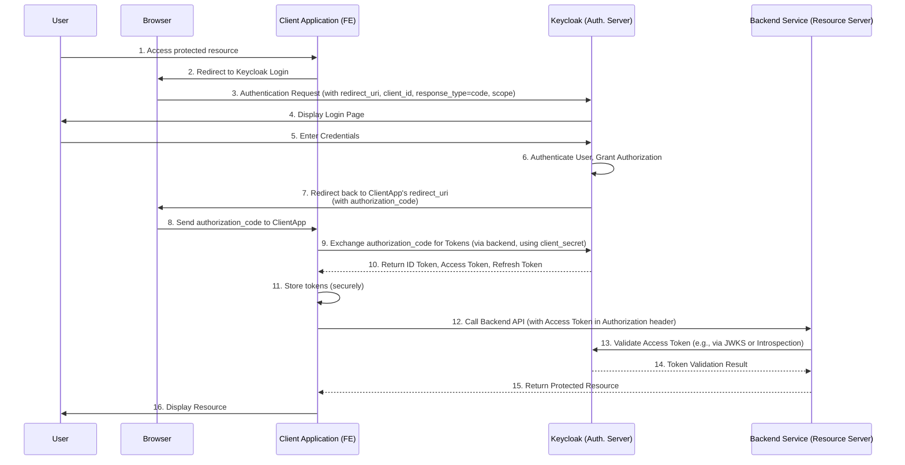
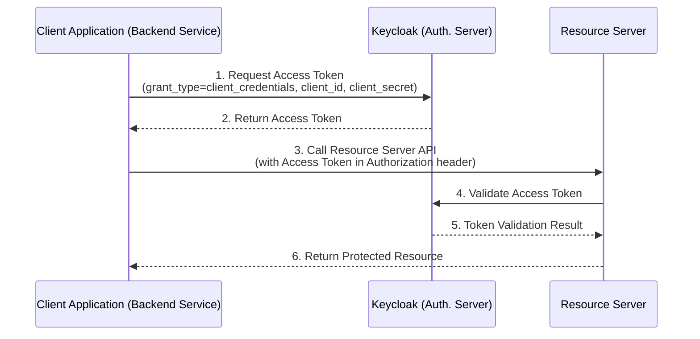

# 🔑 Keycloak In-Depth Analysis & System Design Guide

---
## 📋 Table of Contents

- **1.** [Introduction to Keycloak](#1-introduction-to-keycloak)
- **2.** [The Problem Keycloak Solves: ID & Auth Fragmentation](#2-the-problem-keycloak-solves-id--auth-fragmentation)
- **3.** [What is Keycloak?](#3-what-is-keycloak)
- **4.** [Core Concepts](#4-core-concepts)
    - **4.1** [Identity and Access Management (IAM)](#41-identity-and-access-management-iam)
    - **4.2** [Single Sign-On (SSO)](#42-single-sign-on-sso)
    - **4.3** [OpenID Connect (OIDC)](#43-openid-connect-oidc)
    - **4.4** [OAuth 2.0](#44-oauth-20)
    - **4.5** [SAML 2.0](#45-saml-20)
    - **4.6** [Realm](#46-realm)
    - **4.7** [Client](#47-client)
    - **4.8** [User](#48-user)
    - **4.9** [Role & Group](#49-role--group)
- **5.** [Keycloak Architecture](#5-keycloak-architecture)
- **6.** [Common OAuth 2.0/OIDC Flows with Keycloak](#6-common-oauth-20oidc-flows-with-keycloak)
    - **6.1** [Authorization Code Flow (Recommended)](#61-authorization-code-flow-recommended)
    - **6.2** [Client Credentials Flow](#62-client-credentials-flow)
- **7.** [Basic Installation and Configuration](#7-basic-installation-and-configuration)
    - **7.1** [Installation with Docker](#71-installation-with-docker)
    - **7.2** [Accessing the Admin Console](#72-accessing-the-admin-console)
    - **7.3** [Creating a Realm, Client, and User](#73-creating-a-realm-client-and-user)
- **8.** [Application Integration (Client Integration)](#8-application-integration-client-integration)
    - **8.1** [Example: Spring Boot OAuth2 Client](#81-example-spring-boot-oauth2-client)
- **9.** [Keycloak in System Design](#9-keycloak-in-system-design)
    - **9.1** [When to Use Keycloak?](#91-when-to-use-keycloak)
    - **9.2** [Advantages](#92-advantages)
    - **9.3** [Disadvantages & Challenges](#93-disadvantages--challenges)
    - **9.4** [Deployment Considerations](#94-deployment-considerations)
- **10.** [Comparison with Other Solutions](#10-comparison-with-other-solutions)
    - **10.1** [Keycloak vs. Auth0/Okta (SaaS)](#101-keycloak-vs-auth0okta-saas)
    - **10.2** [Keycloak vs. Build-Your-Own](#102-keycloak-vs-build-your-own)
- **11.** [Conclusion & Next Steps](#11-conclusion--next-steps)

---

## 1. Introduction to Keycloak

In the era of distributed applications, microservices, and multi-platform systems, managing identity and controlling access has become extremely complex. How can a user log in once to access multiple different applications? How can we efficiently manage hundreds or thousands of users and assign them permissions? Keycloak is the answer to these challenges.

---

## 2. The Problem Keycloak Solves: ID & Auth Fragmentation

Before solutions like Keycloak, each application typically built its own registration, login, and user management system. This led to:

- **Poor user experience:** Having to log in again for each application.
- **Weak security:** Each application had to handle password hashing and session management itself, leading to potential security vulnerabilities.
- **High development costs:** Repeating the work of building authentication/authorization features in many places.
- **Difficult management:** No centralized view of users and their permissions across the entire system.
- **Difficult third-party integration:** If you wanted to log in with Google or Facebook, each application had to integrate it separately.

Keycloak centralizes the authentication and authorization process, solving all of the above problems.

---

## 3. What is Keycloak?

Keycloak is an **open-source Identity and Access Management (IAM) solution** from Red Hat. It provides centralized identity and access management features, including:

- **Single Sign-On (SSO):** Users log in once to access multiple applications.
- **Standard Protocols Support:** Supports industry standards like OpenID Connect (OIDC), OAuth 2.0, and SAML 2.0.
- **User Federation:** Integrates with existing identity management systems (LDAP, Active Directory).
- **Social Login:** Allows users to log in with social media accounts (Google, Facebook, GitHub...).
- **Encryption & Hashing:** Automatically handles security for passwords and tokens.
- **Admin Console & Account Management:** An intuitive web interface for managing users, clients, realms, and configurations.
- **Role-Based Access Control (RBAC):** Manages permissions based on roles.

> **Expert Note:** Keycloak acts as an **Identity Provider (IdP)** or **Authorization Server**. It is responsible for authenticating users, issuing tokens (ID Token, Access Token, Refresh Token), and managing sessions. Your applications (Service Providers/Resource Servers) delegate authentication to Keycloak.

---

## 4. Core Concepts

### 4.1 Identity and Access Management (IAM)

A framework for managing digital identities (e.g., users, applications) and controlling what they are allowed to access (permissions). Keycloak is an IAM platform.

### 4.2 Single Sign-On (SSO)

Allows a user to authenticate once and access multiple different applications without needing to log in again. Keycloak does this by managing a centralized login session.

### 4.3 OpenID Connect (OIDC)

A layer built on top of OAuth 2.0 that allows clients to verify a user's identity and obtain basic profile information through an **ID Token** (a JWT). OIDC is the recommended standard for user authentication scenarios.

### 4.4 OAuth 2.0

An authorization framework that allows an application to access protected resources on a Resource Server on behalf of a user, without needing to know the user's password. OAuth 2.0 defines "grant types" (flows) for issuing **Access Tokens**. OAuth 2.0 is **not for user authentication**; it is only for **authorizing access** to resources.

### 4.5 SAML 2.0

Security Assertion Markup Language (SAML) is an XML-based standard for exchanging authentication and authorization data between an Identity Provider and a Service Provider. It is often used in enterprise environments, especially for integrating with legacy systems.

### 4.6 Realm

In Keycloak, a `Realm` is an isolated space for managing a set of users, applications (clients), roles, and security configurations. Each realm is completely isolated from other realms.

> - **Expert Note:** You can create multiple realms for different purposes, for example: one realm for customers (external users), one realm for internal employees (internal users), or separate realms for different environments (dev, staging, prod) if you don't want to share configurations. The `master` realm is the default realm used for managing Keycloak itself.

### 4.7 Client

A `Client` in Keycloak is any application or service that wants to be protected by Keycloak. It could be a web application (frontend), a backend service (microservice), or a mobile application. Each client has its own ID and security configuration.

> - **Expert Note:** When creating a client, you need to choose the appropriate `Client type`:
>   - **OpenID Connect:** Most common for web/mobile applications.
>     - `public`: For applications that cannot keep a secret (frontend JavaScript, mobile apps).
>     - `confidential`: For applications that can keep a secret (backend services, web server-side rendering apps).
>   - **SAML:** For SAML integrations.

### 4.8 User

These are the user accounts managed by Keycloak. Each user can belong to groups and have roles assigned to them.

### 4.9 Role & Group

- **Role:** A set of permissions. You assign roles to users or to the tokens issued to clients.
  - `Realm Roles`: Global roles within a realm.
  - `Client Roles`: Roles specific to a client (application).
- **Group:** A collection of users. You can assign roles to a group, and all users in that group will inherit those roles.
> - **Expert Note:** Use a combination of Groups and Roles to manage access permissions effectively and scalably. Avoid assigning roles directly to individual users when the number of users is large.

---

## 5. Keycloak Architecture

Keycloak runs on a Java server (WildFly/Quarkus) and is typically deployed as a set of services.

```mermaid
graph TD
    subgraph Frontend Applications
        WebApp[Web Application] -- OAuth 2.0/OIDC --> Keycloak
        SPA[SPA/Mobile App] -- OAuth 2.0/OIDC --> Keycloak
    end

    subgraph Backend Services (Resource Servers)
        BackendService1[Microservice A] --> TokenValidation[Token Validation]
        BackendService2[Microservice B] --> TokenValidation
    end

    subgraph Keycloak Server
        Keycloak[Keycloak Server] -- Auth, Token Issuance --> UserStore[User Storage (DB)]
        Keycloak -- User Federation --> LDAP[LDAP/AD]
        Keycloak -- Social Login --> Google[Google/Facebook]
    end

    TokenValidation -- Token Introspection / JWKS --> Keycloak
    UserStore -- Persistent Data --> Database(PostgreSQL/MySQL)

    style UserStore fill:#f9f,stroke:#333,stroke-width:2px
    style Database fill:#fcb,stroke:#333,stroke-width:2px
```
_High-level architecture diagram of Keycloak in a system._

**Explanation:**

- **Keycloak Server:** The central hub for handling authentication and authorization.
- **User Storage:** Keycloak stores user information in its internal database (H2 by default, but PostgreSQL/MySQL/MariaDB is recommended for production). It can also integrate with existing user management systems like LDAP or Active Directory through its User Federation feature.
- **Client Applications (Frontend):** Web apps, SPAs, and mobile apps will redirect users to Keycloak for authentication. After successful authentication, Keycloak returns tokens (ID Token, Access Token, Refresh Token) to the application.
- **Backend Services (Resource Servers):** Microservices or backend APIs will receive an Access Token from the client and need to verify its validity. This is usually done by checking the JWT's signature (using the JWKS - JSON Web Key Set from Keycloak) or by calling Keycloak's Introspection API. Once the token is verified, the backend can use the information within the token (e.g., user roles) to perform authorization.

---

## 6. Common OAuth 2.0/OIDC Flows with Keycloak

### 6.1 Authorization Code Flow (Recommended)

This is the most secure and recommended flow for web and mobile applications. It ensures that the Access Token is never exposed in the URL or the browser.


```mermaid
sequenceDiagram
    participant User
    participant Browser
    participant ClientApp as Client Application (FE)
    participant Keycloak as Keycloak (Auth. Server)
    participant Backend as Backend Service (Resource Server)

    User->>ClientApp: 1. Access protected resource
    ClientApp->>Browser: 2. Redirect to Keycloak Login
    Browser->>Keycloak: 3. Authentication Request (with redirect_uri, client_id, response_type=code, scope)
    Keycloak->>User: 4. Display Login Page
    User->>Keycloak: 5. Enter Credentials
    Keycloak->>Keycloak: 6. Authenticate User, Grant Authorization
    Keycloak->>Browser: 7. Redirect back to ClientApp's redirect_uri<br>   (with authorization_code)
    Browser->>ClientApp: 8. Send authorization_code to ClientApp
    ClientApp->>Keycloak: 9. Exchange authorization_code for Tokens (via backend, using client_secret)
    Keycloak-->>ClientApp: 10. Return ID Token, Access Token, Refresh Token
    ClientApp->>ClientApp: 11. Store tokens (securely)
    ClientApp->>Backend: 12. Call Backend API (with Access Token in Authorization header)
    Backend->>Keycloak: 13. Validate Access Token (e.g., via JWKS or Introspection)
    Keycloak-->>Backend: 14. Token Validation Result
    Backend-->>ClientApp: 15. Return Protected Resource
    ClientApp->>User: 16. Display Resource
```
_Sequence diagram of the Authorization Code Flow with Keycloak._

### 6.2 Client Credentials Flow

This flow is used when an application (client) needs to access protected resources without the involvement of an end-user. It's typically used for server-to-server communication.


```mermaid
sequenceDiagram
    participant ClientApp as Client Application (Backend Service)
    participant Keycloak as Keycloak (Auth. Server)
    participant ResourceServer as Resource Server

    ClientApp->>Keycloak: 1. Request Access Token<br>   (grant_type=client_credentials, client_id, client_secret)
    Keycloak-->>ClientApp: 2. Return Access Token
    ClientApp->>ResourceServer: 3. Call Resource Server API<br>   (with Access Token in Authorization header)
    ResourceServer->>Keycloak: 4. Validate Access Token
    Keycloak-->>ResourceServer: 5. Token Validation Result
    ResourceServer-->>ClientApp: 6. Return Protected Resource
```
_Sequence diagram of the Client Credentials Flow with Keycloak._

---

## 7. Basic Installation and Configuration

Keycloak can be installed on various platforms (standalone, Docker, Kubernetes). The easiest way to get started is with Docker.

### 7.1 Installation with Docker

1.  **Run the Keycloak Container:**
    ```bash
    docker run -p 8080:8080 -e KEYCLOAK_ADMIN=admin -e KEYCLOAK_ADMIN_PASSWORD=admin --name keycloak-server quay.io/keycloak/keycloak:24.0.5 start-dev
    ```
    - `-p 8080:8080`: Maps port 8080 of the container to port 8080 of the host.
    - `-e KEYCLOAK_ADMIN=admin`: Sets the username for the admin console account.
    - `-e KEYCLOAK_ADMIN_PASSWORD=admin`: Sets the password for the admin console account.
    - `quay.io/keycloak/keycloak:24.0.5`: The Keycloak image (it's recommended to use the latest stable version).
    - `start-dev`: Starts in development mode (doesn't require HTTPS, easier to configure for dev).

2.  **Wait for Keycloak to start:** This process might take a few minutes.

### 7.2 Accessing the Admin Console

Open your browser and go to: `http://localhost:8080/admin/`

Log in with the `admin/admin` account you created above.

### 7.3 Creating a Realm, Client, and User

1.  **Create a new Realm:**
    - In the Admin Console, hover over `Master` in the top-left corner and select `Create Realm`.
    - Enter a `Name` (e.g., `my-app-realm`), then click `Create`.
2.  **Create a new Client:**
    - In `my-app-realm`, select `Clients` from the left menu.
    - Click `Create client`.
    - Enter a `Client ID` (e.g., `frontend-app`).
    - Click `Next`.
    - Select `Client authentication` (On/Off - depending on the application type), `Authorization` (On/Off).
    - `Standard flow enabled`: **On** (to use the Authorization Code Flow).
    - `Valid redirect URIs`: Enter `http://localhost:8081/*` (replace with your frontend application's URI, e.g., `http://localhost:3000/*` for a React app, `http://localhost:8081/login/oauth2/code/keycloak` for Spring Boot).
    - `Web origins`: Enter `http://localhost:8081` or `*` (for simplicity in dev, but be specific in prod).
    - Click `Save`.
    - After creating the client, go to its `Credentials` tab (if `Client authentication` is On) to get the `Client Secret`. This is the client's secret and must not be exposed.
3.  **Create a new User:**
    - In `my-app-realm`, select `Users` from the left menu.
    - Click `Create new user`.
    - Enter a `Username` (e.g., `testuser`); other information (Email, First Name, Last Name) is optional.
    - Click `Create`.
    - Go to the `Credentials` tab of the newly created user.
    - Set a `Password` and turn off `Temporary` if you don't want the user to have to change their password on the first login.
    - Click `Set password`.

---

## 8. Application Integration (Client Integration)

Integrating your application with Keycloak typically involves configuring OAuth 2.0/OIDC.

### 8.1 Example: Spring Boot OAuth2 Client

Here is an example of configuring a Spring Boot application as an OAuth2 Client to authenticate with Keycloak.

**Dependencies (`pom.xml`):**
```xml
<dependency>
    <groupId>org.springframework.boot</groupId>
    <artifactId>spring-boot-starter-oauth2-client</artifactId>
</dependency>
<dependency>
    <groupId>org.springframework.boot</groupId>
    <artifactId>spring-boot-starter-web</artifactId>
</dependency>
<dependency>
    <groupId>org.springframework.boot</groupId>
    <artifactId>spring-boot-starter-security</artifactId>
</dependency>
```

**`application.yml`:**
```yaml
spring:
  security:
    oauth2:
      client:
        registration:
          keycloak:
            client-id: frontend-app # The Client ID you created in Keycloak
            client-secret: YOUR_CLIENT_SECRET # The Client Secret for a confidential client (if applicable)
            authorization-grant-type: authorization_code # Use the Authorization Code Flow
            redirect-uri: "{baseUrl}/login/oauth2/code/keycloak" # The URI Keycloak will redirect back to
            scope: openid, profile, email # The scopes to request from Keycloak
        provider:
          keycloak:
            issuer-uri: http://localhost:8080/realms/my-app-realm # The URI of the Keycloak realm
            user-name-attribute: preferred_username # The attribute name in the ID Token/User Info to get the username
  web:
    resources:
      add-mappings: false # Disable default resource mapping in Spring Boot
server:
  port: 8081 # The port for the Spring Boot application
```

**`SecurityConfig.java`:**
```java
import org.springframework.context.annotation.Bean;
import org.springframework.context.annotation.Configuration;
import org.springframework.security.config.annotation.web.builders.HttpSecurity;
import org.springframework.security.config.annotation.web.configuration.EnableWebSecurity;
import org.springframework.security.web.SecurityFilterChain;

@Configuration
@EnableWebSecurity
public class SecurityConfig {

    @Bean
    public SecurityFilterChain securityFilterChain(HttpSecurity http) throws Exception {
        http
            .authorizeHttpRequests(authorize -> authorize
                .requestMatchers("/").permitAll() // Allow access to the home page without authentication
                .anyRequest().authenticated() // All other requests require authentication
            )
            .oauth2Login(oauth2 -> oauth2
                .defaultSuccessUrl("/secured") // Redirect after successful login
            )
            .logout(logout -> logout
                .logoutSuccessUrl("/") // Redirect after logout
            );
        return http.build();
    }
}
```

**Simple Controller:**
```java
import org.springframework.security.core.annotation.AuthenticationPrincipal;
import org.springframework.security.oauth2.core.user.OAuth2User;
import org.springframework.stereotype.Controller;
import org.springframework.ui.Model;
import org.springframework.web.bind.annotation.GetMapping;

@Controller
public class HomeController {

    @GetMapping("/")
    public String publicPage() {
        return "public-page"; // A public HTML page
    }

    @GetMapping("/secured")
    public String securedPage(@AuthenticationPrincipal OAuth2User oauth2User, Model model) {
        if (oauth2User != null) {
            // Get information from the OAuth2User (provided by the ID Token / UserInfo Endpoint)
            model.addAttribute("username", oauth2User.getAttribute("preferred_username"));
            model.addAttribute("name", oauth2User.getAttribute("name"));
            model.addAttribute("email", oauth2User.getAttribute("email"));
            // You can get other attributes depending on the requested scopes
        }
        return "secured-page"; // An HTML page that requires authentication
    }
}
```

> **Expert Note:** For a frontend JavaScript application (React, Angular, Vue), you would use a client-side OIDC library (e.g., `oidc-client-js`, `@react-keycloak/web`) to handle the login flows and token management.

---

## 9. Keycloak in System Design

### 9.1 When to Use Keycloak?

- **Systems with multiple applications:** When you need SSO for web, mobile, and/or backend services.
- **Need for centralized user management:** When you need a single place to manage users, roles, and groups.
- **Need to integrate external Identity Providers:** To allow login with Google, Facebook, LinkedIn, or enterprise IdPs (LDAP, Active Directory).
- **High security requirements:** Keycloak adheres to industry standards and is developed by Red Hat.
- **Need for flexible access control:** RBAC, Group-based access.
- **Want an Open Source/On-premise solution:** You can self-host and customize Keycloak.

### 9.2 Advantages

- **Open Source & Free:** No license costs, can be customized.
- **Supports Industry Standards:** OIDC, OAuth 2.0, SAML 2.0, SCIM.
- **Rich Feature Set:** SSO, Social Login, User Federation, MFA (Multi-Factor Authentication), Account Management, Admin Console.
- **Easy to Deploy:** Can be run with Docker, Kubernetes.
- **Large Community:** Easy to find support and documentation.
- **Scalability:** Supports clustering and works with a Load Balancer.

### 9.3 Disadvantages & Challenges

- **Initial Complexity:** Setting up and configuring Keycloak can be time-consuming for newcomers.
- **Resource Requirements:** As a Java application, Keycloak requires a certain amount of RAM and CPU, especially in a production environment.
- **Operational Costs (Ops):** Self-hosting Keycloak requires knowledge of server management, databases, and security. Compared to SaaS services, the operational cost can be higher.
- **Upgrades:** Upgrading major versions of Keycloak can be complex.
- **Deep Customization:** If you need to customize the authentication flow or user interface extensively, you may need to develop Service Provider Interface (SPI) plugins, which requires knowledge of Java and Keycloak internals.

### 9.4 Deployment Considerations

- **Database:** Always use a robust, persistent database (PostgreSQL, MySQL) instead of the default H2 for production.
- **Caching:** Configuring caching for Keycloak is crucial for high performance, especially in a clustered environment.
- **High Availability (HA):** Deploy Keycloak in a cluster mode with multiple nodes behind a Load Balancer to ensure high availability.
- **HTTPS:** Always use HTTPS for all communication with Keycloak in a production environment.
- **Logging & Monitoring:** Set up comprehensive logging and monitoring to track performance and detect security/operational issues.
- **Backup & Restore:** Have a strategy for backing up Keycloak's database.
- **Eviction:** Set up cache eviction policies to avoid memory overflow.
- **Key Rotation:** Have a strategy for periodically rotating Keycloak's signing keys to enhance security.

---

## 10. Comparison with Other Solutions

### 10.1 Keycloak vs. Auth0/Okta (SaaS)

- **Keycloak (On-premise/Open Source):**
  - **Pros:** Full control over data, no license fees, deep customization, suitable for strict compliance requirements.
  - **Cons:** Self-managed and operated (Ops overhead), requires internal resources.
- **Auth0/Okta (SaaS):**
  - **Pros:** Managed service (no Ops worries), easy integration, fast support, many out-of-the-box features.
  - **Cons:** Cost is based on the number of users/Monthly Active Users (MAU), less control over infrastructure/data, difficult to customize deeply.

> **Tech Lead's Advice:** If you have the operational resources and require absolute control or need to comply with strict regulations, Keycloak is a good choice. If you want to deploy quickly, reduce the operational burden, and are willing to pay, SaaS services are the priority.

### 10.2 Keycloak vs. Build-Your-Own

- **Keycloak:**
  - **Pros:** Based on proven industry standards, solves most security and authentication/authorization challenges.
  - **Cons:** Still requires learning and configuration.
- **Build-Your-Own:**
  - **Pros:** Completely customizable, no external dependencies.
  - **Cons:** **Extremely high risk in terms of security and cost:** It is very difficult to build a secure authentication system that complies with all standards and handles attack scenarios. It will take a lot of time and effort to maintain.

> **Tech Lead's Advice:** **Absolutely do not build an authentication system from scratch** unless you are a security company with a very strong team of experts and have a very specific reason. Always use proven solutions like Keycloak or SaaS services.

---

## 11. Conclusion & Next Steps

- **You have:** Gained an overview of Keycloak, understood the core concepts (IAM, SSO, OIDC, OAuth2, SAML), architecture, common authentication flows, basic installation, and how to integrate it with a Spring Boot application. Especially the evaluations and advice from a System Design perspective.
- **Tech Lead's Advice:** Keycloak is a powerful tool that helps simplify and secure the authentication/authorization system in modern applications. However, deploying and operating it requires a certain understanding of security standards and system management.
- **What to try next (Next Steps):**
  1. **Experiment with other Client types:** Integrate an SPA (React/Angular/Vue) with Keycloak using client-side OIDC libraries.
  2. **Explore User Federation:** Configure Keycloak to connect to a mock LDAP/Active Directory server.
  3. **Deploy a Keycloak Cluster:** Set up a Keycloak cluster on Kubernetes or Docker Compose to understand high availability and scalability.
  4. **Learn about the Admin REST API:** Keycloak provides a powerful REST API to automate the management of realms, clients, and users.
  5. **Research Authorization Services:** Keycloak is not just for authentication; it also has a powerful authorization module based on Policy-Based Access Control (PBAC) for complex scenarios.
