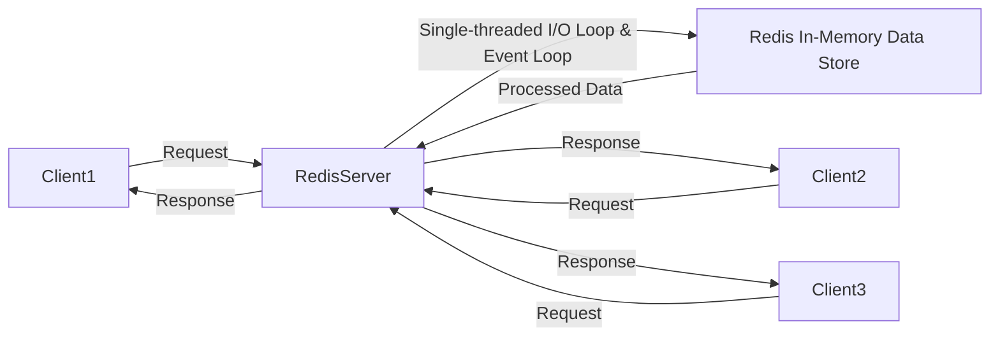
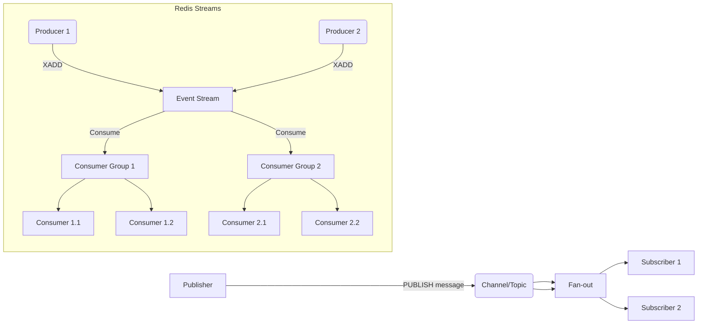

# Redis In-Depth Analysis & System Design Guide

*Role-play: You’re both a Redis novice (“Novice”) and a seasoned Tech Lead (“Expert”) diving into Redis together.*

---

## 📋 Table of Contents
1. [Giới thiệu](#_1-giới-thiệu)
2. [Novice Q&A: Redis là gì?](#_2-novice-qa-redis-là-gì)
3. [Expert Deep Dive: Kiến trúc & Data Types](#_3-expert-deep-dive-kiến-trúc--data-types)
    3.1 [Kiến trúc cơ bản](#_31-kiến-trúc-cơ-bản)
    3.2 [Các Data Types chính](#_32-các-data-types-chính)
4. [Use Cases Phổ biến](#_4-use-cases-phổ-biến)
5. [System Design Patterns với Redis](#_5-system-design-patterns-với-redis)
    5.1 [Cache-Aside Pattern](#_51-cache-aside-pattern)
    5.2 [Write-Through / Write-Behind](#_52-write-through--write-behind)
    5.3 [Pub/Sub & Streams](#_53-pubsub--streams)
    5.4 [Distributed Locks (Khóa phân tán)](#_54-distributed-locks-khóa-phân-tán)
    5.5 [Rate Limiting (Giới hạn tốc độ)](#_55-rate-limiting-giới-hạn-tốc-độ)
6. [Ví dụ Thực tế: Caching Layer với Java](#_6-ví-dụ-thực-tế-caching-layer-với-java)
7. [Kiến trúc Redis (Diagrams chi tiết)](#_7-kiến-trúc-redis-diagrams-chi-tiết)
8. [Hiệu năng & Phân phối tải](#_8-hiệu-năng--phân-phối-tải)
9. [Persistence (Lưu trữ bền vững)](#_9-persistence-lưu-trữ-bền-vững)
10. [Kết luận & Next Steps](#_10-kết-luận--next-steps)

---

## 1. Giới thiệu <a id="_1-giới-thiệu"></a>
Redis (REmote DIctionary Server) là một in-memory data store cực nhanh, thường được dùng làm cache, message broker, session store… Nó giữ toàn bộ dữ liệu trong RAM, cho phép truy xuất với độ trễ microsecond (µs).

**Expert Note:** Redis không chỉ là một Key-Value store đơn thuần. Điểm mạnh vượt trội của nó là khả năng hỗ trợ đa dạng cấu trúc dữ liệu phức tạp trực tiếp trong bộ nhớ, cùng với các operations nguyên tử (atomic operations) trên các cấu trúc đó. Điều này giúp giảm đáng kể độ phức tạp logic ở phía ứng dụng và tối ưu hiệu suất.

---

## 2. Novice Q&A: Redis là gì? <a id="_2-novice-qa-redis-là-gì"></a>
**Novice:** “Tại sao mình nghe Redis thường đi kèm từ ‘in-memory’?”

**Expert:**
* Redis lưu trữ toàn bộ dữ liệu trực tiếp trong bộ nhớ RAM của server, thay vì trên các thiết bị lưu trữ thứ cấp như ổ cứng SSD/HDD. Điều này là yếu tố then chốt giúp nó đạt được tốc độ đọc/ghi cực kỳ nhanh, với độ trễ chỉ khoảng vài micro giây.
* Tuy nhiên, dữ liệu trong RAM sẽ bị mất khi server bị tắt hoặc khởi động lại. Để khắc phục điều này và đảm bảo tính bền vững (durability), Redis cung cấp các cơ chế Persistence (lưu trữ bền vững) như **Snapshotting (RDB)** và **Append-Only File (AOF)**. Chúng ta sẽ đi sâu hơn vào phần Persistence sau.

**Novice:** “Redis khác gì so với database truyền thống (RDBMS)?”

**Expert:**
* **Không thay thế hoàn toàn RDBMS:** Redis không được thiết kế để thay thế hoàn toàn các hệ quản trị cơ sở dữ liệu quan hệ (RDBMS) như MySQL, PostgreSQL. Nó không có khái niệm về join bảng, schema nghiêm ngặt, hoặc các tính năng phức tạp của SQL như transaction đa bảng với ACID đầy đủ.
* **Mục đích sử dụng khác biệt:** Redis phù hợp nhất khi bạn ưu tiên tốc độ truy xuất dữ liệu cực cao và cần lưu trữ các loại dữ liệu không cấu trúc hoặc bán cấu trúc như key/value, danh sách (lists), tập hợp (sets), bộ đếm (counters), hoặc thực hiện các mô hình Pub/Sub (Publish/Subscribe) thời gian thực.
* **Tốc độ vs. Tính toàn vẹn dữ liệu phức tạp:** RDBMS tối ưu cho việc đảm bảo tính toàn vẹn và nhất quán của dữ liệu phức tạp với các mối quan hệ, trong khi Redis tối ưu cho tốc độ và khả năng phục vụ lượng lớn request dữ liệu đơn giản hoặc cached.

**Novice:** "Vậy khi nào thì em nên dùng Redis?"

**Expert:**
Bạn nên xem xét Redis khi:
* **Tốc độ là yếu tố sống còn:** Ứng dụng của bạn yêu cầu phản hồi dưới mili giây.
* **Dữ liệu không quá phức tạp về mối quan hệ:** Dữ liệu có thể biểu diễn tốt dưới dạng Key-Value hoặc các cấu trúc dữ liệu cơ bản của Redis.
* **Cần giảm tải cho database chính:** Bằng cách cache dữ liệu thường xuyên truy cập.
* **Cần các tính năng thời gian thực:** Như hàng đợi, bộ đếm, Pub/Sub, session.

---

## 3. Expert Deep Dive: Kiến trúc & Data Types <a id="_3-expert-deep-dive-kiến-trúc--data-types"></a>

### 3.1 Kiến trúc cơ bản <a id="_31-kiến-trúc-cơ-bản"></a>
Redis được thiết kế để đạt hiệu suất cao với kiến trúc đơn giản nhưng rất hiệu quả:
* **Single-threaded I/O Loop:** Redis sử dụng một luồng (thread) duy nhất để xử lý tất cả các yêu cầu I/O (đọc từ network, ghi vào network). Điều này có vẻ phản trực giác, nhưng nó hoạt động hiệu quả nhờ cơ chế **Multiplexing I/O** (sử dụng `epoll` trên Linux, `kqueue` trên macOS/BSD). Điều này cho phép Redis quản lý hàng ngàn kết nối đồng thời mà không cần tạo ra nhiều luồng riêng biệt, giảm thiểu overhead của việc chuyển đổi ngữ cảnh (context switching) và khóa (locking) giữa các luồng.
    * **Expert Note:** Mô hình single-threaded giúp việc lập trình và bảo trì Redis core trở nên đơn giản hơn, đồng thời loại bỏ các vấn đề phức tạp của multi-threading như race conditions hay deadlocks trong chính lõi xử lý dữ liệu. Tuy nhiên, nó cũng có nghĩa là các lệnh Redis cần được thực thi rất nhanh. Nếu có một lệnh nào đó mất quá nhiều thời gian (ví dụ: `KEYS` trên một database lớn, hoặc `BLPOP` với timeout lớn), nó sẽ chặn toàn bộ các lệnh khác.
* **Event Loop:** Redis hoạt động dựa trên một Event Loop. Nó liên tục lắng nghe các sự kiện (có request đến, có dữ liệu sẵn sàng để đọc, có kết nối bị đóng). Khi một sự kiện xảy ra, nó sẽ được xử lý trong vòng lặp này:
    1.  **Nhận request:** Đọc dữ liệu từ socket.
    2.  **Xử lý in-memory:** Thực hiện lệnh Redis (GET, SET, LPUSH, SADD, v.v.) trực tiếp trong RAM.
    3.  **Trả response:** Ghi kết quả trả về vào socket để gửi lại client.



_Sơ đồ minh họa kiến trúc Single-threaded I/O Loop của Redis._

### 3.2 Các Data Types chính

Redis không chỉ là Key-Value store, mà còn cung cấp nhiều cấu trúc dữ liệu mạnh mẽ, giúp giải quyết nhiều bài toán phức tạp một cách hiệu quả ngay từ cơ sở dữ liệu:

|Data Type|Mô tả|Use Case điển hình|Expert Note & Best Practices|
|---|---|---|---|
|**String**|Kiểu dữ liệu cơ bản nhất, lưu trữ giá trị là chuỗi văn bản hoặc dữ liệu nhị phân (binary safe). Có thể lưu trữ lên đến 512MB. Hỗ trợ các thao tác như `GET`, `SET`, `INCR` (tăng giá trị số), `APPEND`.|Cache HTML fragment, JSON object, User session token, bộ đếm (counters) đơn giản.|**Advice:** Rất hiệu quả cho caching. Khi dùng `INCR`, hãy tận dụng tính nguyên tử của Redis để tạo bộ đếm chính xác, ví dụ lượt truy cập, số lượng tin nhắn. Khi lưu JSON, hãy đảm bảo bạn cũng cache các trường riêng lẻ của JSON nếu chúng thường xuyên được truy cập độc lập, hoặc dùng kiểu Hash.|
|**List**|Một danh sách các chuỗi được sắp xếp theo thứ tự chèn vào. Có thể thêm/bớt phần tử từ đầu (head) hoặc cuối (tail) với các lệnh như `LPUSH`, `RPUSH`, ``LPOP`,` RPOP`. Lý tưởng cho hàng đợi.|Task queue, Feeds/Timelines (ví dụ: các bài viết mới nhất của bạn bè), Lịch sử các hành động gần đây của người dùng.|**Advice:** Cân nhắc giữa `LPUSH/RPUSH` và `LPOP/RPOP` tùy thuộc vào việc bạn muốn một queue FIFO (First-In-First-Out) hay LIFO (Last-In-First-Out). Sử dụng `BLPOP`/`BRPOP` để tạo các worker queue bền vững, nơi worker chờ đợi tin nhắn mà không cần polling.|
|**Set**|Một tập hợp các chuỗi duy nhất, không có thứ tự. Hỗ trợ các phép toán tập hợp như `UNION` (hợp), `INTERSECTION` (giao), `DIFFERENCE` (hiệu) giữa các sets.|Danh sách người dùng duy nhất truy cập một trang, Danh sách các tags của một bài viết, Danh sách bạn bè chung.|**Advice:** Cực kỳ mạnh mẽ cho các bài toán liên quan đến tập hợp. Dùng `SADD` để thêm, `SISMEMBER` để kiểm tra tồn tại, `SRANDMEMBER` để lấy ngẫu nhiên. Khi xử lý các mối quan hệ N-N (ví dụ: User - Tag), Sets là lựa chọn hiệu quả hơn so với việc query RDBMS nhiều lần.|
|**Sorted Set**|Giống như Set nhưng mỗi phần tử có thêm một "score" (điểm số). Các phần tử được tự động sắp xếp theo score. Hỗ trợ lấy phần tử theo score hoặc theo thứ tự.|Leaderboard (bảng xếp hạng), Bảng điểm trò chơi, Lịch trình các sự kiện (schedule), Danh sách người dùng online có điểm số cao.|**Advice:** Hoàn hảo cho các bảng xếp hạng động. `ZADD` để thêm/cập nhật, `ZRANGE` để lấy top N, `ZSCORE` để lấy điểm của một phần tử. Score có thể là timestamp để tạo ra một danh sách sắp xếp theo thời gian và vẫn giữ được tính duy nhất của các phần tử.|
|**Hash**|Một map (ánh xạ) từ trường (field) sang giá trị (value) bên trong một key. Tương tự như đối tượng JSON hoặc Row trong SQL.|Lưu trữ thông tin User profile (username, email, last_login), Chi tiết sản phẩm, Session của người dùng (nhiều thuộc tính).|**Advice:** Lý tưởng để lưu trữ các object có nhiều thuộc tính. `HSET` để đặt nhiều trường, `HGETALL` để lấy tất cả, `HGET` để lấy một trường cụ thể. Việc sử dụng Hash giúp tiết kiệm bộ nhớ so với việc lưu từng thuộc tính thành một String riêng lẻ (vì Redis phải lưu key cho mỗi String).|
|**Stream**|Kiểu dữ liệu giống như một log append-only, nơi các sự kiện được thêm vào cuối và được gán một ID duy nhất. Hỗ trợ **Consumer Groups** để nhiều consumer có thể xử lý các phần khác nhau của stream một cách độc lập.|Message queue (bền vững hơn List), Event log, Chuyển đổi dữ liệu (CDC - Change Data Capture), Hệ thống thông báo phân tán.|**Advice:** Đây là một trong những kiểu dữ liệu mạnh mẽ nhất của Redis cho các kiến trúc hướng sự kiện. Nó cung cấp tính bền vững (dữ liệu không mất khi restart), khả năng replay (đọc lại sự kiện cũ), và khả năng phân chia công việc cho nhiều consumer (Consumer Groups). Cân nhắc dùng Streams thay vì Lists nếu bạn cần một hàng đợi tin nhắn phức tạp hơn.|
|**GeoSpatial**|Lưu trữ các cặp tọa độ vĩ độ/kinh độ và tên địa điểm. Hỗ trợ các truy vấn dựa trên khoảng cách.|Tìm kiếm địa điểm gần nhất, Lấy danh sách bạn bè trong một bán kính nhất định, Uber-like matching.|**Advice:** Dùng `GEOADD`, `GEORADIUS` (hoặc `GEOSEARCH` trong Redis 6+). Đây là một tính năng mạnh mẽ để xây dựng các ứng dụng dựa trên vị trí mà không cần database chuyên dụng cho GIS.|
|**HyperLogLog**|Cấu trúc dữ liệu ước lượng số lượng phần tử duy nhất trong một tập hợp lớn với một lượng bộ nhớ rất nhỏ (chỉ 12KB). Hỗ trợ `PFADD`, `PFCOUNT`.|Ước lượng số lượng người dùng duy nhất truy cập trang web, số lượng truy vấn tìm kiếm duy nhất, số lượng IP duy nhất.|**Advice:** Lý tưởng cho các bài toán cần đếm số lượng duy nhất mà không yêu cầu độ chính xác tuyệt đối (có sai số nhỏ, khoảng 0.81%). Tiết kiệm bộ nhớ đáng kể khi đếm hàng tỷ phần tử so với Set.|
|**Bitmap**|Một chuỗi bit, nơi mỗi bit có thể được bật (1) hoặc tắt (0). Hỗ trợ các thao tác bitwise.|Lưu trữ trạng thái đăng nhập của người dùng (tài khoản 1 đã đăng nhập ngày 10/10), Theo dõi số ngày người dùng hoạt động trong tháng, Danh sách người dùng đã đọc một bài viết.|**Advice:** Cực kỳ hiệu quả về bộ nhớ khi lưu trữ các trạng thái boolean cho một tập hợp lớn các ID. `SETBIT` để bật/tắt, `GETBIT` để kiểm tra, `BITCOUNT` để đếm số bit bật. Hoàn hảo cho các tính năng "đã xem" hoặc "đã hoạt động".|

---

## 4. Use Cases Phổ biến

1. **Caching Layer:** Giảm tải cho database chính bằng cách lưu trữ tạm thời dữ liệu thường xuyên được truy cập. Khi ứng dụng cần dữ liệu, nó kiểm tra Redis trước, nếu không có (cache miss) thì mới truy vấn database và lưu lại vào Redis.
    
    - **Expert Note:** Đây là use case phổ biến nhất. Đảm bảo bạn có chiến lược cache hợp lý (Cache-Aside, Write-Through/Behind) và quản lý TTL (Time To Live) hiệu quả để dữ liệu không bị stale (cũ).
        
2. **Session Store:** Lưu trữ thông tin phiên làm việc của người dùng (ví dụ: trạng thái đăng nhập, giỏ hàng tạm thời) trong các ứng dụng web phân tán.
    
    - **Expert Note:** Redis Hash là kiểu dữ liệu lý tưởng cho Session Store do có thể lưu trữ nhiều thuộc tính của session dưới dạng các trường riêng biệt, và TTL cho phép session tự động hết hạn.
        
3. **Real-time Analytics (Bộ đếm & Thống kê):** Sử dụng String (với `INCR`), Hashes, HyperLogLog để xây dựng các bộ đếm thời gian thực cho lượt xem trang, lượt tải xuống, người dùng online duy nhất, v.v.
    
    - **Expert Note:** Redis cực nhanh cho các thao tác tăng/giảm số, làm cho nó lý tưởng cho các bộ đếm không yêu cầu độ chính xác tuyệt đối ngay lập tức, hoặc các bộ đếm tạm thời.
        
4. **Message Broker / Pub-Sub:** Redis Pub/Sub cho phép các client đăng ký (subscribe) vào các kênh (channels) và nhận tin nhắn khi có client khác xuất bản (publish) tin nhắn vào kênh đó. Streams cung cấp một giải pháp hàng đợi bền vững và phức tạp hơn.
    
    - **Expert Note:** Redis Pub/Sub phù hợp cho các thông báo thời gian thực đơn giản (ví dụ: chat room, cập nhật tin tức nhanh). Đối với các hàng đợi cần đảm bảo tin nhắn được xử lý (at-least-once delivery) và phân phối cho nhiều worker, Redis Streams là lựa chọn ưu việt.
        
5. **Leaderboards & Rating Systems:** Sử dụng Sorted Sets để dễ dàng tạo và cập nhật bảng xếp hạng với điểm số và thứ hạng.
    
    - **Expert Note:** Với Sorted Sets, bạn có thể lấy top N người chơi, người chơi xung quanh một người chơi cụ thể, hoặc cập nhật điểm số mà Redis tự động sắp xếp lại vị trí.
        

---

## 5. System Design Patterns với Redis

Redis là một công cụ linh hoạt, cho phép bạn triển khai nhiều design pattern khác nhau để tối ưu hiệu suất và kiến trúc hệ thống.

### 5.1 Cache-Aside Pattern

Đây là pattern phổ biến nhất khi sử dụng Redis làm cache.

- **Mô tả:** Ứng dụng (App) sẽ kiểm tra Redis trước khi truy vấn database chính. Nếu dữ liệu có trong Redis (cache hit), nó sẽ được trả về ngay lập tức. Nếu không có (cache miss), ứng dụng sẽ truy vấn database, sau đó lưu dữ liệu vào Redis và trả về cho client.
    
- **Ưu điểm:** Đơn giản để triển khai, dữ liệu trong cache luôn "fresh" dựa trên TTL (Time To Live) hoặc khi bị xóa thủ công (cache invalidation).
    
- **Nhược điểm:** Dữ liệu có thể bị stale (cũ) trong một khoảng thời gian ngắn nếu dữ liệu trong DB thay đổi nhưng cache chưa được cập nhật/invalidated. Phải xử lý logic cache miss.
    

Đoạn mã

```mermaid
graph TD
    A[Application] -->|1 Request Data| B{Redis Cache?}
    B -->|2 Cache Hit (Data found)| A
    B -->|3 Cache Miss (Data not found)| C[Database]
    C -->|4 Fetch Data| A
    A -->|5 Store Data in Redis (with TTL)| B
    A -->|6 Return Data to User| End
```

_Sơ đồ luồng hoạt động của Cache-Aside Pattern._

**Expert Advice:** Luôn đặt một TTL hợp lý cho dữ liệu trong cache. Cân nhắc các chiến lược Cache Invalidation (ví dụ: xóa cache khi dữ liệu trong DB thay đổi) để tránh dữ liệu stale.

### 5.2 Write-Through / Write-Behind

Các pattern này thường dùng khi bạn muốn Redis là nơi ghi dữ liệu đầu tiên, và Redis sẽ chịu trách nhiệm đồng bộ xuống database chính.

- **Write-Through:**
    
    - **Mô tả:** Ứng dụng ghi dữ liệu vào Redis. Redis ngay lập tức ghi (đồng bộ) dữ liệu đó xuống RDBMS hoặc cơ sở dữ liệu chính. Chỉ khi Redis đã xác nhận việc ghi xuống DB thành công, nó mới trả về phản hồi cho ứng dụng.
        
    - **Ưu điểm:** Đảm bảo tính nhất quán giữa Redis và DB chính ngay lập tức.
        
    - **Nhược điểm:** Độ trễ của thao tác ghi bị ảnh hưởng bởi tốc độ của DB chính.
        
- **Write-Behind (Write-Back):**
    
    - **Mô tả:** Ứng dụng ghi dữ liệu vào Redis. Redis trả về phản hồi ngay lập tức cho ứng dụng. Sau đó, Redis sẽ ghi dữ liệu xuống RDBMS hoặc cơ sở dữ liệu chính một cách không đồng bộ (asynchronously), thường theo một lịch trình batch hoặc khi có đủ dữ liệu.
        
    - **Ưu điểm:** Tốc độ ghi cực nhanh cho ứng dụng vì không phải chờ DB chính.
        
    - **Nhược điểm:** Có rủi ro mất dữ liệu nếu Redis gặp sự cố trước khi kịp flush dữ liệu xuống DB chính. Dữ liệu có thể không nhất quán tạm thời giữa Redis và DB.
        

**Expert Advice:** Write-Through / Write-Behind ít phổ biến hơn Cache-Aside cho các trường hợp cache đơn thuần. Chúng thường được dùng khi Redis đóng vai trò như một Primary Data Store tạm thời hoặc như một tầng đệm ghi hiệu suất cao (Write Buffer) trước khi dữ liệu được ghi bền vững vào hệ thống chậm hơn. Cần cân nhắc kỹ lưỡng về tính bền vững và nhất quán dữ liệu khi sử dụng các pattern này.

### 5.3 Pub/Sub & Streams

Redis cung cấp hai cơ chế mạnh mẽ cho giao tiếp giữa các thành phần trong hệ thống phân tán:

- **Pub/Sub (Publish/Subscribe):**
    
    - **Mô tả:** Các client (Publisher) gửi tin nhắn đến một kênh (Channel). Các client khác (Subscriber) đã đăng ký vào kênh đó sẽ nhận được tin nhắn theo thời gian thực.
        
    - **Ưu điểm:** Đơn giản, tốc độ cao, lý tưởng cho Real-time Notifications, Chat rooms.
        
    - **Nhược điểm:** Tin nhắn không bền vững (volatile) - nếu Subscriber không kết nối tại thời điểm tin nhắn được Publish, họ sẽ bỏ lỡ tin nhắn đó. Không có Consumer Groups.
        
    - **Expert Advice:** Thích hợp cho các trường hợp "fire-and-forget", nơi việc mất một vài tin nhắn là chấp nhận được (ví dụ: thông báo có lượt thích mới, cập nhật chứng khoán).
        
- **Streams:**
    
    - **Mô tả:** Là một log append-only, bền vững, nơi các tin nhắn (events) được thêm vào với một ID duy nhất. Nó hỗ trợ **Consumer Groups**, cho phép nhiều consumer cùng đọc từ một stream mà không bị trùng lặp tin nhắn và ghi nhớ vị trí đọc cuối cùng của mỗi consumer group.
        
    - **Ưu điểm:** Tin nhắn bền vững (persistent), có thể đọc lại (replay), hỗ trợ phân phối tin nhắn cho nhiều consumer worker trong một nhóm.
        
    - **Nhược điểm:** Phức tạp hơn Pub/Sub.
        
    - **Expert Advice:** Nên ưu tiên Streams cho các hệ thống hàng đợi tin nhắn quan trọng, kiến trúc hướng sự kiện (Event-Driven Architectures), hoặc Change Data Capture (CDC) khi bạn cần đảm bảo tin nhắn không bị mất và có thể xử lý song song bởi nhiều worker.
        

Đoạn mã



_Sơ đồ minh họa Pub/Sub và Streams trong Redis._

### 5.4 Distributed Locks (Khóa phân tán)

- **Mô tả:** Trong các hệ thống phân tán (multi-instance applications), khi nhiều tiến trình (process) hoặc server muốn truy cập và sửa đổi một tài nguyên chung (ví dụ: một bản ghi trong database, một file, hoặc một bộ đếm), Distributed Lock đảm bảo rằng chỉ một tiến trình được phép truy cập tại một thời điểm. Redis là một lựa chọn tuyệt vời cho distributed locks do tốc độ và tính nguyên tử của các lệnh.
    
- **Cách triển khai cơ bản:**
    
    - Sử dụng lệnh `SET key value NX PX milliseconds` (NX: set nếu key không tồn tại; PX: set expiration time in milliseconds).
        
    - Nếu `SET` thành công, nghĩa là bạn đã lấy được khóa.
        
    - Khi hoàn thành, `DEL key` để giải phóng khóa.
        
- **Ưu điểm:** Đơn giản để triển khai với các lệnh Redis cơ bản.
    
- **Nhược điểm:**
    
    - **Deadlock:** Nếu một tiến trình lấy được khóa và bị crash trước khi giải phóng khóa, khóa sẽ bị kẹt. `PX` (expiration time) giúp giảm thiểu nhưng không loại bỏ hoàn toàn vấn đề này.
        
    - **Fencing Token:** Trong một số trường hợp phức tạp hơn (ví dụ: kết nối mạng bị giật lag), có thể cần thêm "fencing token" để đảm bảo rằng một tiến trình đã mất quyền truy cập không ghi đè lên dữ liệu đã được sửa đổi bởi tiến trình khác đã lấy được khóa sau đó.
        
    - **Redlock:** Redis đã từng đề xuất thuật toán Redlock cho các cluster đa master, nhưng nó vẫn là chủ đề gây tranh cãi về tính đúng đắn trong các trường hợp cạnh tranh cao.
        
- **Expert Advice:** Đối với các hệ thống yêu cầu độ tin cậy cao và an toàn tuyệt đối cho Distributed Lock, hãy cân nhắc các thư viện đã được kiểm chứng (ví dụ: Redisson cho Java) hoặc các hệ thống chuyên dụng cho consensus như ZooKeeper hoặc Apache Curator. Đối với các trường hợp đơn giản hơn (ít cạnh tranh, chấp nhận rủi ro nhỏ), Redis Lock cơ bản là đủ.
    

### 5.5 Rate Limiting (Giới hạn tốc độ)

- **Mô tả:** Giới hạn số lượng yêu cầu mà một người dùng, IP, hoặc API key có thể thực hiện trong một khoảng thời gian nhất định để ngăn chặn lạm dụng, tấn công DDoS hoặc bảo vệ tài nguyên.
    
- **Cách triển khai (Sliding Window Log):**
    
    - Sử dụng Redis List hoặc Sorted Set. Mỗi khi có yêu cầu, thêm timestamp hiện tại vào List/Sorted Set.
        
    - Xóa các timestamp cũ hơn cửa sổ thời gian (ví dụ: 1 phút) khỏi List/Sorted Set.
        
    - Kiểm tra số lượng phần tử còn lại. Nếu vượt quá ngưỡng, từ chối yêu cầu.
        
- **Cách triển khai (Fixed Window Counter):**
    
    - Sử dụng Redis String (với `INCR`) và `EXPIRE`. Mỗi khi có yêu cầu, tăng bộ đếm và đặt TTL cho bộ đếm.
        
    - Nếu bộ đếm vượt ngưỡng, từ chối yêu cầu.
        
- **Ưu điểm:** Rất hiệu quả và nhanh chóng nhờ các thao tác nguyên tử của Redis.
    
- **Nhược điểm:** Cần quản lý chính xác các key và expiration time.
    
- **Expert Advice:** Fixed Window Counter đơn giản hơn nhưng có thể bị "burst" requests tại điểm chuyển cửa sổ. Sliding Window Log chính xác hơn nhưng phức tạp hơn và tiêu tốn nhiều bộ nhớ hơn. Cân nhắc dùng các thư viện đã có sẵn (ví dụ: [RateLimiter của Google Guava](https://www.google.com/search?q=https://github.com/google/guava/wiki/RateLimiterExplained) hoặc các thư viện tích hợp Redis như `redisson` cho Java) để quản lý Rate Limiting một cách robust.
    

---

## 6. Ví dụ Thực tế: Caching Layer với Java

Chúng ta sẽ sử dụng thư viện `Jedis` (một client Redis phổ biến cho Java) để minh họa Cache-Aside Pattern.

### 6.1 Dependency (Maven `pom.xml`)

XML

```
<dependency>
    <groupId>redis.clients</groupId>
    <artifactId>jedis</artifactId>
    <version>5.1.2</version> </dependency>
<dependency>
    <groupId>com.fasterxml.jackson.core</groupId>
    <artifactId>jackson-databind</artifactId>
    <version>2.17.1</version> </dependency>
```

### 6.2 Ví dụ Code Java

Java

```
package com.example.redisguide.cache;

import redis.clients.jedis.Jedis;
import com.fasterxml.jackson.databind.ObjectMapper;
import com.fasterxml.jackson.core.JsonProcessingException;

// Giả định một lớp UserProfile
class UserProfile {
    private Long id;
    private String username;
    private String email;
    // ... các trường khác

    // Constructors
    public UserProfile() {}

    public UserProfile(Long id, String username, String email) {
        this.id = id;
        this.username = username;
        this.email = email;
    }

    // Getters and Setters
    public Long getId() { return id; }
    public void setId(Long id) { this.id = id; }
    public String getUsername() { return username; }
    public void setUsername(String username) { this.username = username; }
    public String getEmail() { return email; }
    public void setEmail(String email) { this.email = email; }

    @Override
    public String toString() {
        return "UserProfile{" +
               "id=" + id +
               ", username='" + username + ''' +
               ", email='" + email + ''' +
               '}';
    }
}

// Giả định một lớp Database Client
class DatabaseClient {
    public UserProfile fetchProfile(Long userId) {
        System.out.println("Fetching user profile from Database for ID: " + userId + " ...");
        // Giả lập độ trễ truy vấn DB
        try {
            Thread.sleep(2000); // 2 giây
        } catch (InterruptedException e) {
            Thread.currentThread().interrupt();
        }
        // Giả lập trả về dữ liệu từ DB
        return new UserProfile(userId, "user_" + userId, "user" + userId + "@example.com");
    }
}

public class UserProfileCache {

    private final Jedis jedis;
    private final DatabaseClient dbClient;
    private final ObjectMapper objectMapper; // Để chuyển đổi Object <-> JSON

    public UserProfileCache(String redisHost, int redisPort) {
        this.jedis = new Jedis(redisHost, redisPort);
        this.dbClient = new DatabaseClient();
        this.objectMapper = new ObjectMapper();
        System.out.println("Connected to Redis: " + jedis.ping()); // Kiểm tra kết nối
    }

    public UserProfile getUserProfile(Long userId) throws JsonProcessingException {
        String key = "user:profile:" + userId; // Key trong Redis
        String cachedProfileJson = jedis.get(key); // 1. Kiểm tra cache Redis

        if (cachedProfileJson != null) {
            System.out.println("Cache Hit for user ID: " + userId);
            return objectMapper.readValue(cachedProfileJson, UserProfile.class); // Trả về từ cache
        }

        // Cache Miss
        System.out.println("Cache Miss for user ID: " + userId + ". Fetching from DB...");
        UserProfile profile = dbClient.fetchProfile(userId); // 2. Lấy từ Database
        
        if (profile != null) {
            String profileJson = objectMapper.writeValueAsString(profile);
            jedis.setex(key, 3600, profileJson); // 3. Lưu vào Redis với TTL 1 giờ (3600 giây)
            System.out.println("User profile for ID: " + userId + " stored in Redis cache.");
        }
        return profile; // 4. Trả về cho ứng dụng
    }

    public void close() {
        jedis.close();
    }

    public static void main(String[] args) throws JsonProcessingException {
        // Đảm bảo Redis Server đang chạy trên localhost:6379
        UserProfileCache cache = new UserProfileCache("localhost", 6379);

        // Lần gọi đầu tiên - Cache Miss
        System.out.println("
--- Lần gọi đầu tiên (ID 1) ---");
        UserProfile user1 = cache.getUserProfile(1L);
        System.out.println("Fetched User 1: " + user1);

        // Lần gọi thứ hai - Cache Hit
        System.out.println("
--- Lần gọi thứ hai (ID 1) ---");
        UserProfile user1Cached = cache.getUserProfile(1L);
        System.out.println("Fetched User 1 (cached): " + user1Cached);

        // Lần gọi cho một ID khác - Cache Miss
        System.out.println("
--- Lần gọi đầu tiên (ID 2) ---");
        UserProfile user2 = cache.getUserProfile(2L);
        System.out.println("Fetched User 2: " + user2);

        cache.close();
    }
}
```

**Expert Note:** Trong thực tế, bạn nên sử dụng một Connection Pool (ví dụ: `JedisPool` của Jedis hoặc tích hợp với Spring Data Redis) thay vì tạo `Jedis` instance trực tiếp để quản lý kết nối hiệu quả hơn và tránh lỗi. Đối tượng `ObjectMapper` cũng nên được tạo một lần và tái sử dụng.

---

## 7. Kiến trúc Redis (Diagrams chi tiết)

### 7.1 Redis Standalone (Master-Only)

Đây là kiến trúc cơ bản nhất, chỉ có một Redis server duy nhất.

Đoạn mã

```mermaid
graph TD
    Client[Application Clients] --- Request/Response --> RedisMaster[Redis Server (Master)]
    RedisMaster --> InternalMemory[In-Memory Data Store]
    RedisMaster --- Persistence[Persistence (RDB/AOF)]
```

Sơ đồ kiến trúc Redis Standalone.

Expert Advice: Chỉ nên dùng cho môi trường phát triển hoặc các ứng dụng nhỏ, không yêu cầu tính sẵn sàng cao hay khả năng mở rộng. Điểm yếu duy nhất (Single Point of Failure - SPOF).

### 7.2 Redis Replication (Master-Replica)

Thiết lập này cải thiện tính sẵn sàng (High Availability) và khả năng mở rộng đọc (Read Scalability).

- **Master:** Xử lý tất cả các thao tác ghi (writes) và đồng bộ dữ liệu tới các Replica.
    
- **Replica (Slaves):** Chỉ xử lý các thao tác đọc (reads) và nhận dữ liệu từ Master.
    
- **Sentinel:** Một hệ thống giám sát độc lập, tự động chuyển đổi Master (failover) nếu Master hiện tại gặp sự cố.
    

Đoạn mã

```mermaid
graph TD
    subgraph Clients
      A[Application Write Clients] --> RedisMaster
      B[Application Read Clients] --> RedisMaster
      B --> RedisReplica1
      B --> RedisReplica2
    end

    subgraph Redis Cluster (Sentinel-managed)
      RedisMaster[Redis Master] -->|Writes, Reads| Database[In-Memory Data]
      RedisMaster -- Async Replication --> RedisReplica1[Redis Replica 1]
      RedisMaster -- Async Replication --> RedisReplica2[Redis Replica 2]

      RedisReplica1 -->|Reads| Database1[In-Memory Data]
      RedisReplica2 -->|Reads| Database2[In-Memory Data]

      Sentinel1[Redis Sentinel 1] -- Monitor --> RedisMaster
      Sentinel1 -- Monitor --> RedisReplica1
      Sentinel1 -- Monitor --> RedisReplica2

      Sentinel2[Redis Sentinel 2] -- Monitor --> RedisMaster
      Sentinel2 -- Monitor --> RedisReplica1
      Sentinel2 -- Monitor --> RedisReplica2

      Sentinel3[Redis Sentinel 3] -- Monitor --> RedisMaster
      Sentinel3 -- Monitor --> RedisReplica1
      Sentinel3 -- Monitor --> RedisReplica2

      RedisMaster -- Sync Persistence --> RDBAOFMaster[RDB/AOF Master]
      RedisReplica1 -- Sync Persistence --> RDBAOFReplica1[RDB/AOF Replica 1]
    end

    RedisMaster -.-> RDBMS[Database Chính (SQL/NoSQL)]
    RedisReplica1 -.-> RDBMS
```

_Sơ đồ kiến trúc Redis Master-Replica với Sentinel (tính sẵn sàng cao)._

**Expert Advice:** Đây là kiến trúc phổ biến cho nhiều ứng dụng web. Chia tải đọc cho các Replica để tăng throughput. Sentinel là thành phần quan trọng để đảm bảo tính sẵn sàng tự động (Automatic Failover).

### 7.3 Redis Cluster

Đây là giải pháp mở rộng quy mô ngang (Horizontal Scaling / Sharding) của Redis, cho phép dữ liệu được phân chia trên nhiều node khác nhau.

- **Sharding (Phân vùng):** Dữ liệu được chia thành 16384 "hash slots". Mỗi key được map vào một slot, và mỗi slot được gán cho một node Master cụ thể.
    
- **Tính sẵn sàng cao:** Mỗi node Master có thể có một hoặc nhiều Replica. Nếu một Master thất bại, một trong các Replica của nó sẽ được thăng cấp lên Master.
    
- **Client-Side Sharding:** Client thông minh sẽ biết key nào thuộc về node nào và gửi request trực tiếp đến node đó.
    

Đoạn mã

```mermaid
graph LR
    C[Client Application] --> Router{Redis Cluster Client (JedisCluster, Lettuce)}
    Router --> RedisMaster1[Redis Master 1 (Slots 0-5460)]
    Router --> RedisMaster2[Redis Master 2 (Slots 5461-10922)]
    Router --> RedisMaster3[Redis Master 3 (Slots 10923-16383)]

    RedisMaster1 -- Replicate --> RedisReplica1_1[Redis Replica 1.1]
    RedisMaster2 -- Replicate --> RedisReplica2_1[Redis Replica 2.1]
    RedisMaster3 -- Replicate --> RedisReplica3_1[Redis Replica 3.1]

    subgraph Cluster Management
        RedisMaster1 -- Heartbeat --> RedisMaster2
        RedisMaster1 -- Heartbeat --> RedisMaster3
        RedisReplica1_1 -- Monitor --> RedisMaster1
        RedisReplica2_1 -- Monitor --> RedisMaster2
        RedisReplica3_1 -- Monitor --> RedisMaster3
    end
```

_Sơ đồ kiến trúc Redis Cluster (phân phối tải & tính sẵn sàng cao)._

**Expert Advice:** Sử dụng Redis Cluster khi bạn cần lưu trữ lượng dữ liệu quá lớn cho một server hoặc cần throughput cực cao mà một Master-Replica đơn không đáp ứng được. Nó phức tạp hơn trong việc thiết lập và quản lý.

---

## 8. Hiệu năng & Phân phối tải

- **Latency (Độ trễ):**
    
    - Redis nổi tiếng với độ trễ cực thấp: khoảng **~100 micro giây (µs)** cho thao tác đọc và **~200 micro giây (µs)** cho thao tác ghi trên phần cứng tiêu chuẩn.
        
    - **Expert Note:** Độ trễ này là của bản thân Redis server. Tổng độ trễ từ phía ứng dụng của bạn sẽ bao gồm độ trễ mạng và thời gian xử lý của client library.
        
- **Throughput (Thông lượng):**
    
    - Redis có thể đạt hàng trăm ngàn đến hàng triệu thao tác mỗi giây (ops/s) trên phần cứng vừa phải (modest hardware). Con số này phụ thuộc vào loại lệnh (đơn giản như GET/SET hay phức tạp hơn như ZUNIONSTORE), kích thước dữ liệu, và cấu hình mạng.
        
- **Scaling out (Mở rộng quy mô ngang):**
    
    - **Replication (Sao chép):** Bằng cách thiết lập một Master và nhiều Replica, bạn có thể phân phối các yêu cầu đọc đến các Replica, giúp giảm tải cho Master và tăng tổng thông lượng đọc của hệ thống. Master vẫn là điểm tắc nghẽn cho các thao tác ghi.
        
    - **Sharding (Phân vùng) / Redis Cluster Mode:** Đây là phương pháp để mở rộng cả khả năng đọc và ghi. Dữ liệu được chia nhỏ (sharded) và phân phối trên nhiều node Master độc lập (mỗi Master có thể có Replica riêng). Điều này cho phép bạn lưu trữ lượng dữ liệu lớn hơn nhiều so với khả năng của một máy chủ duy nhất và xử lý thông lượng đọc/ghi cao hơn bằng cách phân tán công việc trên nhiều node.
        

---

## 9. Persistence (Lưu trữ bền vững)

Như đã đề cập, Redis là in-memory, nhưng nó cung cấp các cơ chế để đảm bảo dữ liệu không bị mất khi server tắt hoặc gặp sự cố.

### 9.1 RDB (Redis Database / Snapshotting)

- **Mô tả:** RDB là một phương pháp lưu trữ bền vững bằng cách tạo ra các **snapshot** (bản chụp) dữ liệu Redis tại một thời điểm nhất định. Toàn bộ dataset được ghi vào một file nhị phân (`dump.rdb`) trên đĩa.
    
- **Cách hoạt động:** Redis tạo một tiến trình con (fork) để ghi snapshot, đảm bảo Redis Master vẫn có thể xử lý request.
    
- **Ưu điểm:**
    
    - Rất nhỏ gọn và hiệu quả về dung lượng lưu trữ.
        
    - Khôi phục dữ liệu nhanh hơn AOF khi Redis khởi động lại.
        
    - Tốt cho việc sao lưu dữ liệu toàn bộ.
        
- **Nhược điểm:**
    
    - Không đảm bảo an toàn dữ liệu 100% - có thể mất dữ liệu giữa các lần snapshot nếu Redis bị crash.
        
    - Việc fork tiến trình có thể tạm thời gây ra spike về bộ nhớ và CPU.
        
- **Expert Advice:** Phù hợp cho các trường hợp cache nơi việc mất một lượng nhỏ dữ liệu là chấp nhận được, hoặc khi dùng làm bản sao lưu định kỳ.
    

### 9.2 AOF (Append-Only File)

- **Mô tả:** AOF ghi lại **mọi thao tác ghi (write operation)** mà Redis nhận được vào một file log theo định dạng chỉ thêm vào (append-only log). Khi khởi động lại, Redis sẽ đọc lại file AOF để tái tạo lại dataset.
    
- **Cách hoạt động:** Các lệnh ghi được ghi vào AOF trước khi được thực thi, hoặc sau khi thực thi và phản hồi đã gửi.
    
- **Ưu điểm:**
    
    - An toàn dữ liệu cao hơn RDB, vì mọi thay đổi đều được ghi lại.
        
    - Có thể cấu hình mức độ `fsync` (ghi xuống đĩa) để cân bằng giữa hiệu suất và an toàn dữ liệu (ví dụ: `everysec` - mỗi giây một lần, `always` - mỗi lệnh một lần).
        
- **Nhược điểm:**
    
    - File AOF lớn hơn RDB.
        
    - Tái tạo dataset khi khởi động có thể chậm hơn RDB nếu file AOF quá lớn.
        
- **Expert Advice:** Nên sử dụng AOF nếu bạn không muốn mất bất kỳ dữ liệu nào khi Redis bị crash (ví dụ: Session Store, Queue). Kết hợp AOF với RDB là cách tốt nhất để có cả tốc độ khôi phục và an toàn dữ liệu cao nhất.
    

### 9.3 RDB + AOF (Mixed Persistence)

- **Mô tả:** Kể từ Redis 4.0, bạn có thể kết hợp cả RDB và AOF. Redis sẽ tạo một file AOF chứa cả dữ liệu RDB snapshot ở đầu và các lệnh AOF sau đó.
    
- **Ưu điểm:**
    
    - Khởi động nhanh như RDB (đọc snapshot ban đầu).
        
    - Đảm bảo an toàn dữ liệu cao như AOF (nhờ các lệnh ghi sau đó).
        
- **Expert Advice:** Đây là cấu hình Persistence được khuyến nghị cho hầu hết các trường hợp sử dụng production, cung cấp sự cân bằng tốt nhất giữa hiệu suất khôi phục và an toàn dữ liệu.
    

---

## 10. Kết luận & Next Steps

- **Bạn đã:** Có cái nhìn sâu sắc về Redis, bao gồm khái niệm `in-memory`, các kiểu dữ liệu mạnh mẽ, các System Design Patterns phổ biến (Cache-Aside, Write-Through/Behind, Pub/Sub, Streams, Distributed Locks, Rate Limiting), một ví dụ Caching Layer bằng Java, các kiến trúc triển khai (Standalone, Master-Replica, Cluster) và các cơ chế Persistence (RDB, AOF).
    
- **Expert Advice:**
    
    - **Hiểu rõ Use Case:** Trước khi triển khai, hãy xác định rõ ràng bài toán bạn muốn giải quyết bằng Redis. Đừng dùng Redis chỉ vì nó "nhanh", hãy dùng khi nó thực sự giải quyết vấn đề hiệu quả hơn các giải pháp khác.
        
    - **Ưu tiên Đơn Giản:** Bắt đầu với Master-Replica (có Sentinel) trước khi nghĩ đến Cluster Mode. Cluster phức tạp hơn nhiều.
        
    - **Cấu hình Persistence cẩn thận:** Đừng bao giờ chạy Redis trong production mà không có Persistence hoặc sao lưu định kỳ, trừ khi dữ liệu của bạn hoàn toàn là cache và có thể được tái tạo dễ dàng. Mixed persistence là lựa chọn tốt.
        
    - **Quản lý bộ nhớ:** Redis là in-memory, hãy theo dõi sát sao mức độ sử dụng RAM. Khi Redis đạt đến giới hạn bộ nhớ, nó sẽ bắt đầu xóa các key dựa trên eviction policy (ví dụ: LRU - Least Recently Used), hoặc tệ hơn là từ chối các thao tác ghi.
        
    - **Logging & Monitoring:** Luôn có hệ thống log và monitoring mạnh mẽ để theo dõi hiệu suất, độ trễ, throughput, hit/miss ratio của cache, và tình trạng của các node Redis.
        
    - **Đánh giá Client Library:** Chọn client library (như Jedis, Lettuce cho Java) phù hợp với nhu cầu của bạn. Lettuce thường được ưa chuộng hơn cho các ứng dụng reactive/non-blocking, trong khi Jedis đơn giản và dễ dùng cho các trường hợp blocking.
        
    - **Học sâu hơn:** Redis có rất nhiều Module và tính năng nâng cao (ví dụ: RediSearch, RedisJSON, RedisGraph).
        
- **Nên thử (Next Steps):**
    
    1. **Triển khai Redis Cluster trên Docker:** Để hiểu rõ hơn về cách dữ liệu được phân tán và cách client tương tác với cluster.
        
    2. **Khám phá Redis Streams & Consumer Groups:** Xây dựng một ví dụ nhỏ về hệ thống hàng đợi tin nhắn sử dụng Streams để trải nghiệm tính bền vững và khả năng phân phối tin nhắn.
        
    3. **Tích hợp Redis với Spring Data Redis (Java):** Nếu bạn đang dùng Spring Boot, Spring Data Redis cung cấp một abstraction layer tuyệt vời để làm việc với Redis, tích hợp caching, messaging và các tính năng khác một cách dễ dàng.
        
    4. **Thử nghiệm RediSearch:** Nếu bạn có nhu cầu tìm kiếm toàn văn bản (full-text search) trên dữ liệu Redis, RediSearch là một module rất mạnh mẽ.
        

> **Lưu ý**: Copy toàn bộ nội dung vào tệp `redis-guide.md` và mở bằng VS Code, Obsidian hoặc trình soạn thảo ưa thích để tải và tiếp tục chỉnh sửa.