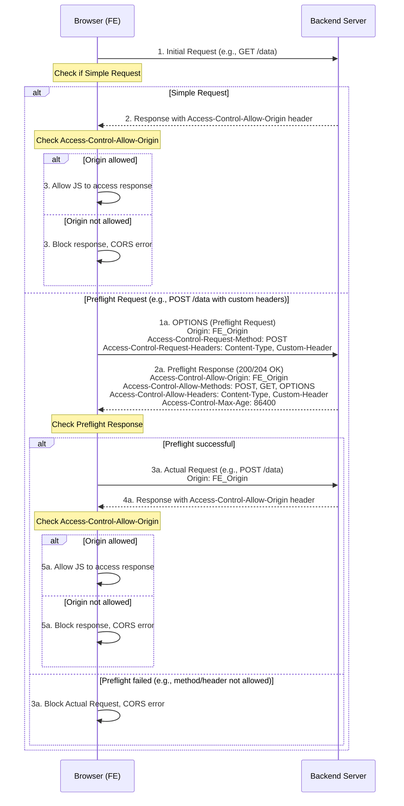

# 🛡️ Cross-Origin Resource Sharing (CORS) - An Overview

---

## 📋 Table of Contents

1. [What is CORS?](https://www.google.com/search?q=%23_what-is-cors)
2. [The Same-Origin Policy (SOP) Mechanism](https://www.google.com/search?q=%23_the-same-origin-policy-sop-mechanism)
3. [When Does CORS Occur?](https://www.google.com/search?q=%23_when-does-cors-occur)
4. CORS Flow of Operation
    4.1 Simple Request
    4.2 Preflight Request
5. [Important HTTP Headers in CORS](https://www.google.com/search?q=%23_important-http-headers-in-cors)
6. Backend Handling (Java Servlet Example)
    6.1 Creating a CorsFilter
    6.2 Note on Access-Control-Allow-Credentials
7. [Note on Proxies/Load Balancers (HAProxy)](https://www.google.com/search?q=%23_note-on-proxiesload-balancers-haproxy)
8. [Some Quick Questions about CORS](https://www.google.com/search?q=%23_some-quick-questions-about-cors)
9. [Summary](https://www.google.com/search?q=%23_summary)
10. [Detailed CORS Flow Diagram](https://www.google.com/search?q=%23_detailed-cors-flow-diagram)

---

## 1. What is CORS?

CORS (Cross-Origin Resource Sharing) is a security mechanism enforced by web browsers that allows or denies HTTP requests from a web application running at **one origin** to access resources from **another origin**.

> ✅ If an HTTP request is made from JavaScript (e.g., `XMLHttpRequest` or `Fetch API`) and is destined for an **origin different** from the current page's origin → the browser will **check the CORS mechanism before sending the actual request** or before returning the response to JavaScript.

**Expert Note:** CORS is not an authentication or authorization method. It is purely a mechanism to allow or deny access to resources from a different origin. User authentication and resource access authorization must still be handled on your backend.

---

## 2. The Same-Origin Policy (SOP) Mechanism

To understand CORS, you first need to know about the **Same-Origin Policy (SOP)**. SOP is a core security mechanism in web browsers that dictates that JavaScript can only interact with resources (e.g., data, an iframe's DOM) that come from the **same origin** from which the script was loaded.

An **Origin** is defined by the combination of `scheme` (protocol), `domain` (hostname), and `port`.

- `scheme`: `http`, `https`
- `domain`: `example.com`, `api.example.com`
- `port`: `:80`, `:443`, `:8080`, `:3000`

**Examples of Origin Pairs:**

| Origin A                        | Origin B                        | Same/Different | Reason                                          |
| ------------------------------- | ------------------------------- | -------------- | ----------------------------------------------- |
| `http://example.com/page1.html` | `http://example.com/page2.html` | Same           | Same scheme, domain, port.                      |
| `http://example.com:80/`        | `http://example.com/`           | Same           | Port 80 is the default for HTTP.                |
| `http://example.com`            | `https://example.com`           | Different      | Different scheme (`http` vs `https`).           |
| `http://example.com`            | `http://api.example.com`        | Different      | Different domain (`example.com` vs `api.example.com`). |
| `http://example.com:8080`       | `http://example.com:3000`       | Different      | Different port.                                 |
| `http://example.com`            | `http://192.168.1.1`            | Different      | Different domain (domain name vs IP).           |

**Purpose of SOP:** To prevent malicious websites from reading sensitive data from other websites that the user is visiting (e.g., banking information, login sessions).

**Role of CORS:** CORS is a "controlled loophole" of SOP, allowing developers to explicitly define which origins are permitted to access their resources, extending the web's capabilities while maintaining security.

---

## 3. When Does CORS Occur?

- CORS only occurs when a web application (running JavaScript) tries to send an HTTP request to a resource at a **different origin** than the one from which the application was loaded.
- CORS is **only enforced by the web browser**.
    - Tools like `curl`, Postman, Insomnia, or backend applications (server-to-server calls) are **not affected** by CORS because they do not follow the browser's Same-Origin Policy. They can send requests anywhere without preflight checks or CORS header validation.
- Cross-origin cases that trigger CORS:
    - `http` ≠ `https` (different scheme)
    - `example.com` ≠ `api.example.com` (different subdomain)
    - `domain.com` ≠ `anotherdomain.com` (different domain)
    - `:8080` ≠ `:3000` (different port)

---

## 4. CORS Flow of Operation

The browser handles cross-origin requests in two main ways: Simple Requests and Preflight Requests.

### 4.1 Simple Request

A request is considered "simple" if it meets **all** of the following conditions:

- Uses one of the HTTP methods: `GET`, `HEAD`, `POST`.
- Only uses safelisted headers such as:
    - `Accept`
    - `Accept-Language`
    - `Content-Language`
    - `Content-Type` (only with values: `application/x-www-form-urlencoded`, `multipart/form-data`, or `text/plain`).
    - `Range`
- Does not use any event listeners on the `XMLHttpRequestUpload` object used for uploads.
- Does not use a `ReadableStream` object in the request.

**Flow of Operation:**

1.  **Browser Sends Main Request:** The browser **automatically attaches the `Origin:` header** (containing the client web page's origin) to the main request and sends it to the server.
2.  **Server Processes and Responds:** The backend server processes the request and, if it wants to allow cross-origin access, must return a response with the `Access-Control-Allow-Origin` header.
    ```http
    Access-Control-Allow-Origin: https://frontend.com
    ```
3.  **Browser Checks:** The browser checks the value of `Access-Control-Allow-Origin` against the client web page's `Origin`.
    - If they match, or if `Access-Control-Allow-Origin: *` (allowing any origin), the browser allows JavaScript to access the response.
    - If they don't match, the browser blocks the response and reports a CORS error.

### 4.2 Preflight Request

If a request **does not meet the conditions for a Simple Request** (e.g., it uses the `PUT`/`DELETE` method, or custom headers like `Authorization`, `X-Custom-Token`, or `Content-Type: application/json`), the browser will perform a "preflight request" first.

**Flow of Operation:**

1.  **Browser Sends Preflight Request (`OPTIONS`):** The browser sends an HTTP request with the `OPTIONS` method to the target URL. This request includes the following headers:
    - `Origin`: The origin of the client web page.
    - `Access-Control-Request-Method`: The HTTP method the main request will use (e.g., `POST`, `PUT`, `DELETE`).
    - `Access-Control-Request-Headers`: A list of non-safelisted headers the main request will send (e.g., `X-Custom-Token`, `Authorization`, `Content-Type`).
    ```http
    // Example Preflight Request
    OPTIONS /api/data HTTP/1.1
    Host: backend.com
    Origin: https://frontend.com
    Access-Control-Request-Method: POST
    Access-Control-Request-Headers: Content-Type, Authorization, X-Custom-Token
    ```
2.  **Backend Responds to Preflight:** The server must respond to this `OPTIONS` request (usually with a `200 OK` or `204 No Content` status code) along with CORS headers indicating which methods, headers, and origins are allowed.
    ```http
    // Example Preflight Response from Backend
    HTTP/1.1 200 OK
    Access-Control-Allow-Origin: https://frontend.com
    Access-Control-Allow-Methods: POST, GET, PUT, DELETE, OPTIONS
    Access-Control-Allow-Headers: Content-Type, Authorization, X-Custom-Token
    Access-Control-Max-Age: 86400 // Optional: Time to cache preflight response (seconds)
    ```
3.  **Browser Checks Preflight Response:**
    - If the headers in the preflight response permit the upcoming request's method, custom headers, and origin, the browser will send the **actual request**.
    - Otherwise, the browser blocks the main request and reports a CORS error.
4.  **Browser Sends Main Request (if Preflight succeeds):** Only if the preflight is successful does the browser send the actual request (e.g., `POST /api/data`) with its `Origin` header.
5.  **Backend Processes and Responds to Main Request:** The server processes the main request and returns a normal response, which **must also include the `Access-Control-Allow-Origin` header** (just like a Simple Request).

**Expert Note:**

- **Performance:** The preflight request adds an extra network round-trip, which can affect performance, especially for frequently called APIs. The `Access-Control-Max-Age` header can help mitigate this by allowing the browser to cache the preflight result for a specified period, avoiding repeated preflight requests for the same URL during that time.
- **Client-side Logic:** The entire CORS checking logic (simple vs. preflight, response header validation) is handled automatically by the browser. Your JavaScript does not need to, and cannot, directly intervene in this process.

---

## 5. Important HTTP Headers in CORS

|Header (Client)|Header (Server)|Description|
|---|---|---|
|`Origin`|`Access-Control-Allow-Origin`|**Client**: The origin of the request. <br>**Server**: The origin that is allowed to access the resource. Can be a specific origin or `*` (allows all - use with caution).|
|`Access-Control-Request-Method`|`Access-Control-Allow-Methods`|**Client (Preflight)**: The HTTP method that will be used for the main request. <br>**Server**: The allowed HTTP methods.|
|`Access-Control-Request-Headers`|`Access-Control-Allow-Headers`|**Client (Preflight)**: The custom headers that will be used for the main request. <br>**Server**: The allowed custom headers.|
|`Cookie` (automatic)|`Access-Control-Allow-Credentials`|**Server**: Specifies whether the request can include credentials (cookies, HTTP authentication, client-side SSL certificates). Must be `true` or absent.|
|(None)|`Access-Control-Expose-Headers`|**Server**: Allows the browser's JavaScript to access custom headers other than the default ones (Cache-Control, Content-Language, Content-Type, Expires, Last-Modified, Pragma).|
|(None)|`Access-Control-Max-Age`|**Server**: The time (in seconds) that the result of a preflight request can be cached by the browser.|

---

## 6. Backend Handling (Java Servlet Example)

To support CORS, your backend must be configured to return the appropriate CORS headers. In a Java Servlet environment, you can create a `Filter`.

### 6.1 Creating a `CorsFilter`

```java
import javax.servlet.*;
import javax.servlet.annotation.WebFilter;
import javax.servlet.http.HttpServletRequest;
import javax.servlet.http.HttpServletResponse;
import java.io.IOException;
import java.util.Arrays;
import java.util.List;

@WebFilter("/*") // Apply filter to all requests
public class CorsFilter implements Filter {

    // List of allowed origins
    private static final List<String> ALLOWED_ORIGINS = Arrays.asList(
        "https://frontend.com", // Specific origin of the frontend application
        "http://localhost:3000" // Or localhost for dev environment
    );

    @Override
    public void doFilter(ServletRequest req, ServletResponse res, FilterChain chain)
            throws IOException, ServletException {

        HttpServletRequest request = (HttpServletRequest) req;
        HttpServletResponse response = (HttpServletResponse) res;

        // Get Origin from request header
        String origin = request.getHeader("Origin");

        // 1. Check if the Origin is allowed
        if (origin != null && ALLOWED_ORIGINS.contains(origin)) {
            // Set Access-Control-Allow-Origin
            response.setHeader("Access-Control-Allow-Origin", origin);

            // Allow credentials (cookies, HTTP auth)
            response.setHeader("Access-Control-Allow-Credentials", "true");
        } else {
            // If the origin is not allowed, you might not set the header or set a default value.
            // For simplicity, this example only sets it if allowed.
        }

        // 2. Handle Preflight Request (OPTIONS)
        if ("OPTIONS".equalsIgnoreCase(request.getMethod())) {
            // Set headers for Preflight response
            // Allowed HTTP methods
            response.setHeader("Access-Control-Allow-Methods", "GET, POST, PUT, DELETE, OPTIONS, HEAD");
            // Allowed custom headers
            response.setHeader("Access-control-allow-headers", "Content-Type, Authorization, X-Custom-Header, X-Requested-With");
            // Preflight response cache duration (seconds). 86400s = 24 hours
            response.setHeader("Access-Control-Max-Age", "86400");

            // Return 200 OK or 204 No Content for the Preflight request
            response.setStatus(HttpServletResponse.SC_OK); // 200 OK
            return; // Stop processing, do not forward the Preflight to other Filters/Servlets
        }

        // 3. Forward the request to the next Filter/Servlet in the chain
        chain.doFilter(req, res);
    }

    @Override
    public void init(FilterConfig filterConfig) throws ServletException {
        // Initialize filter (if needed)
    }

    @Override
    public void destroy() {
        // Clean up resources (if needed)
    }
}
```

**Expert Note:**

- **Wildcard `*`:** Avoid using `Access-Control-Allow-Origin: *` in a production environment if you don't truly want any website to be able to access your API. It can be a security vulnerability.
- **Dynamic Origin:** If you have multiple frontend applications with different origins, you can get the `Origin` header from the request, check if it's in your list of allowed origins, and then return that same `origin` in `Access-Control-Allow-Origin`.

### 6.2 Note on `Access-Control-Allow-Credentials`

- This header allows the browser to send and receive cookies (including session cookies), HTTP Basic Authentication, and client-side SSL certificates in cross-origin requests.
- If `Access-Control-Allow-Credentials` is set to `true`, you **cannot** use `Access-Control-Allow-Origin: *`. You **must** specify a specific origin in `Access-Control-Allow-Origin`. This is to enhance security and prevent potential CSRF attacks.
- If your frontend application needs to send cookies (e.g., to maintain a session) in a cross-origin request, both the client-side (in the Fetch API or XMLHttpRequest) and the server-side must be configured correctly.
    - **Client-side (Fetch API):** `fetch(url, { credentials: 'include' });`
    - **Client-side (XMLHttpRequest):** `xhr.withCredentials = true;`

---

## 7. Note on Proxies/Load Balancers (HAProxy)

When you have a Reverse Proxy or Load Balancer (like HAProxy, Nginx, API Gateway) in front of your backend server, be aware of the following:

- **Allow OPTIONS:** The Load Balancer/Proxy must be configured to allow `OPTIONS` requests to pass through and be forwarded to the backend. Some proxies may block or handle `OPTIONS` requests by default.
- **Do not strip headers:** Ensure the Proxy/Load Balancer does not strip important CORS headers (like `Origin`, `Access-Control-Request-Method`, `Access-Control-Request-Headers` from the request to the backend, and the `Access-Control-Allow-*` headers from the backend's response to the browser).
- **Forwarding headers:** Ensure that CORS-related headers are forwarded correctly between the client, proxy, and backend.

**Expert Advice:** In some microservices architectures or when using an API Gateway, you might consider handling CORS directly at the API Gateway (e.g., Spring Cloud Gateway, Zuul, Kong) instead of at each backend microservice. This centralizes CORS management and avoids repetitive configuration.

---

## 8. Some Quick Questions about CORS

|Question|Answer|
|---|---|
|Is the API called twice?|✅ **Yes**, if it's a Preflight Request (e.g., `PUT`, `DELETE`, or using custom headers), the browser will send an `OPTIONS` request first, then the actual request.|
|What if `Access-Control-Allow-Headers` is not set?|❌ If the frontend sends a custom header (e.g., `Authorization`) and the backend doesn't return it in `Access-Control-Allow-Headers`, the main request will be blocked by the browser.|
|Can I return a `202` code for preflight?|⚠️ You can, but it's standard to use `200 OK` or `204 No Content` for correctness and so the browser clearly understands the intent.|
|Is CORS for authentication?|❌ **No**, CORS is just a mechanism to **check permission to access resources from a different origin**. It is not related to identifying the user or their permissions.|
|Why doesn't Postman get CORS errors?|💡 Because Postman is not a web browser, it does not adhere to the Same-Origin Policy or the CORS mechanism.|

---

## 9. Summary

> CORS is a critical security layer enforced by the **web browser** to prevent JavaScript applications from making unauthorized requests to resources on other origins. For a cross-origin request to succeed, the backend server must respond with the correct CORS HTTP headers to "permit" the browser to proceed with sending or processing the main request. Understanding and configuring CORS correctly is essential for modern web applications.

---

## 10. Detailed CORS Flow Diagram



---

> **Note**: Copy the entire content into a `cors-mechanism.md` file and open it with VS Code, Obsidian, or your favorite editor to download and continue editing.