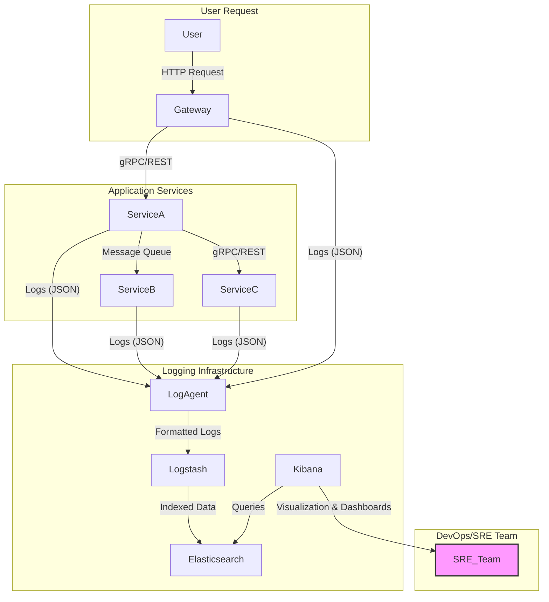

# Phân Tích Chi Tiết: Logging trong Thiết kế Hệ thống Phần mềm

**Tác giả:** GiaTK
**Đối tượng:** Java Developer có kinh nghiệm
**Ngày tạo:** 2025-08-01

---

## 1. Logging là gì và Tại sao lại Tối quan trọng?

Trong kỹ thuật phần mềm, **Logging** là hành động ghi lại các sự kiện, thông tin, hoặc trạng thái xảy ra trong quá trình một ứng dụng đang chạy. Đây không phải là một tính năng dành cho end-user, mà là một công cụ thiết yếu cho đội ngũ phát triển, vận hành (DevOps), và hỗ trợ kỹ thuật.

**Tại sao logging lại tối quan trọng?**

- **Gỡ lỗi (Debugging):** Khi một lỗi xảy ra trên môi trường production mà không thể tái lập trên môi trường dev, log là "hộp đen" duy nhất ghi lại những gì đã thực sự xảy ra, giúp lập trình viên khoanh vùng và xác định nguyên nhân gốc rễ.
- **Giám sát và Theo dõi (Monitoring & Observability):** Log cung cấp một dòng chảy sự kiện theo thời gian thực về sức khỏe của hệ thống. Các công cụ như ELK Stack (Elasticsearch, Logstash, Kibana) hay Grafana Loki có thể phân tích log để tạo ra dashboard, cảnh báo (alerting) khi có dấu hiệu bất thường (ví dụ: số lượng lỗi tăng đột biến, thời gian xử lý một tác vụ quá lâu).
- **Phân tích nghiệp vụ (Business Analytics):** Log có thể chứa thông tin về hành vi người dùng (đã được ẩn danh) hoặc các giao dịch quan trọng. Ví dụ: log lại mỗi khi một đơn hàng được tạo thành công, một sản phẩm được xem, giúp team nghiệp vụ có được insight giá trị.
- **Kiểm toán và An ninh (Auditing & Security):** Ghi lại các sự kiện nhạy cảm như đăng nhập, thay đổi quyền, truy cập dữ liệu quan trọng là yêu cầu bắt buộc trong nhiều ngành (ngân hàng, y tế) để đảm bảo tuân thủ và phát hiện các hành vi xâm nhập trái phép.

> **Golden Rule:** *Logging không phải là một tính năng phụ trợ (afterthought), mà phải được xem là một công dân hạng nhất (first-class citizen) trong thiết kế hệ thống.*

---

## 2. Phân loại các Cấp độ Log (Log Levels)

Hầu hết các logging framework đều hỗ trợ các cấp độ log để phân loại mức độ quan trọng của thông điệp. Việc sử dụng đúng cấp độ log giúp chúng ta có thể lọc và tập trung vào những thông tin cần thiết trong từng ngữ cảnh.

| Cấp độ | Tên đầy đủ | Mục đích sử dụng                                                                                             | Ví dụ                                                              |
| :----- | :--------- | :----------------------------------------------------------------------------------------------------------- | :----------------------------------------------------------------- |
| `TRACE`  | Trace      | Ghi lại thông tin chi tiết nhất về luồng thực thi. Thường chỉ bật trong môi trường dev để debug sâu.         | `Entering method calculatePrice() with params: [item: 'A', quantity: 2]` |
| `DEBUG`  | Debug      | Thông tin hữu ích cho việc gỡ lỗi, trạng thái của các biến, kết quả các bước trung gian.                      | `User 'john.doe' found in cache.`                                  |
| `INFO`   | Information| Ghi lại các sự kiện quan trọng, các cột mốc trong luồng xử lý của ứng dụng ở trạng thái hoạt động bình thường. | `Order 'ORD-12345' was successfully created.`                      |
| `WARN`   | Warning    | Ghi lại các tình huống bất thường, không mong muốn nhưng chưa phải là lỗi. Hệ thống vẫn có thể tiếp tục chạy. | `API endpoint /v1/legacy/user is deprecated. Use /v2/user instead.` |
| `ERROR`  | Error      | Ghi lại các lỗi, ngoại lệ (exception) khiến một tác vụ cụ thể thất bại nhưng không làm sập toàn bộ ứng dụng.  | `Failed to process payment for order 'ORD-12345'. Exception: ...`  |
| `FATAL`  | Fatal      | Ghi lại các lỗi cực kỳ nghiêm trọng khiến toàn bộ ứng dụng phải dừng hoạt động ngay lập tức.                 | `Application startup failed: Could not connect to database.`       |

---

## 3. Best Practices khi Thiết kế Hệ thống Logging

1.  **Sử dụng Logging Facade (SLF4J):** Luôn sử dụng một lớp trừu tượng (facade) như **SLF4J (Simple Logging Facade for Java)** thay vì gọi trực tiếp đến một implementation cụ thể (Logback, Log4j2). Điều này giúp ứng dụng của bạn không bị phụ thuộc vào một thư viện logging duy nhất, có thể thay đổi implementation mà không cần sửa code.

2.  **Structured Logging (Ghi log có cấu trúc):** Thay vì ghi log dưới dạng text thuần túy, hãy ghi log dưới dạng **JSON**.
    *   **Tại sao?** Log dạng JSON dễ dàng được các hệ thống tập trung log (Log Aggregator) như Logstash, Fluentd phân tích (parse), đánh chỉ mục (index) và truy vấn.
    *   **Ví dụ:**
        *   **Không tốt:** `log.info("User " + userId + " logged in from IP " + ipAddress);`
        *   **Tốt (JSON):** `{"timestamp":"...", "level":"INFO", "message":"User logged in", "userId":"abc-123", "sourceIp":"192.168.1.10"}`

3.  **Ghi log theo ngữ cảnh (Contextual Logging):** Sử dụng **MDC (Mapped Diagnostic Context)** của SLF4J để thêm các thông tin ngữ cảnh vào mọi câu log trong một luồng xử lý (ví dụ: một request HTTP). Các thông tin phổ biến là `traceId`, `userId`, `sessionId`. Điều này cực kỳ hữu ích trong kiến trúc microservices để theo dõi một request đi qua nhiều service khác nhau.

4.  **Không bao giờ log thông tin nhạy cảm:** Tuyệt đối không ghi vào log các thông tin như mật khẩu, số thẻ tín dụng, API key, token... Hãy có cơ chế lọc hoặc che (masking) các thông tin này trước khi ghi.

5.  **Log phải mang tính hành động (Actionable):** Một câu log lỗi tốt phải trả lời được các câu hỏi: *Cái gì đã sai? Nó xảy ra ở đâu? Tại sao nó sai? Cần làm gì tiếp theo?*

6.  **Sử dụng Parameterized Messages:** Luôn dùng placeholder `{}` thay vì nối chuỗi.
    *   **Không tốt (tốn hiệu năng):** `log.debug("Processing " + largeObject.toString());` -> `largeObject.toString()` luôn được gọi ngay cả khi level DEBUG bị tắt.
    *   **Tốt (hiệu năng cao):** `log.debug("Processing {}", largeObject);` -> `largeObject.toString()` chỉ được gọi nếu level DEBUG được bật.

7.  **Luôn log stack trace của exception:** Khi bắt một exception, hãy log nó ở cấp độ `ERROR` và truyền cả object exception vào để SLF4J có thể in đầy đủ stack trace.
    *   **Không tốt:** `log.error("An error occurred: " + e.getMessage());` // Mất toàn bộ stack trace!
    *   **Tốt:** `log.error("An error occurred while processing request", e);`

---

## 4. Ví dụ Minh họa trong Java

### a. `java.util.logging` (JUL) - Không khuyến khích dùng

Đây là API có sẵn trong JDK nhưng khá hạn chế và rườm rà.

```java
import java.util.logging.Logger;
import java.util.logging.Level;

public class JulExample {
    private static final Logger LOGGER = Logger.getLogger(JulExample.class.getName());

    public static void main(String[] args) {
        LOGGER.info("This is an info message from JUL.");
        LOGGER.log(Level.SEVERE, "This is a severe error message.", new RuntimeException("JUL Demo Error"));
    }
}
```

### b. `Log4j2`

Một framework mạnh mẽ, hiệu năng cao và rất linh hoạt.

**pom.xml:**
```xml
<dependency>
    <groupId>org.apache.logging.log4j</groupId>
    <artifactId>log4j-api</artifactId>
    <version>2.17.2</version>
</dependency>
<dependency>
    <groupId>org.apache.logging.log4j</groupId>
    <artifactId>log4j-core</artifactId>
    <version>2.17.2</version>
</dependency>
```

**src/main/resources/log4j2.xml:**
```xml
<?xml version="1.0" encoding="UTF-8"?>
<Configuration status="WARN">
    <Appenders>
        <Console name="Console" target="SYSTEM_OUT">
            <PatternLayout pattern="%d{HH:mm:ss.SSS} [%t] %-5level %logger{36} - %msg%n"/>
        </Console>
    </Appenders>
    <Loggers>
        <Root level="info">
            <AppenderRef ref="Console"/>
        </Root>
    </Loggers>
</Configuration>
```

**Java Code:**
```java
import org.apache.logging.log4j.LogManager;
import org.apache.logging.log4j.Logger;

public class Log4j2Example {
    private static final Logger logger = LogManager.getLogger(Log4j2Example.class);

    public void processOrder(String orderId) {
        logger.info("Starting to process order: {}", orderId);
        try {
            // Business logic here
            if (orderId == null) {
                throw new IllegalArgumentException("Order ID cannot be null");
            }
            logger.debug("Order {} validation successful.", orderId);
        } catch (Exception e) {
            logger.error("Failed to process order {}", orderId, e);
        }
    }
}
```

### c. `SLF4J` + `Logback` (Khuyến khích)

Đây là sự kết hợp phổ biến và mạnh mẽ nhất hiện nay.

**pom.xml:**
```xml
<dependency>
    <groupId>org.slf4j</groupId>
    <artifactId>slf4j-api</artifactId>
    <version>1.7.36</version>
</dependency>
<dependency>
    <groupId>ch.qos.logback</groupId>
    <artifactId>logback-classic</artifactId>
    <version>1.2.11</version>
</dependency>
```

**src/main/resources/logback.xml (Cấu hình Rolling Log):**
```xml
<configuration>
    <!-- Appender ghi ra Console -->
    <appender name="STDOUT" class="ch.qos.logback.core.ConsoleAppender">
        <encoder>
            <pattern>%d{yyyy-MM-dd HH:mm:ss.SSS} [%thread] %-5level %logger{36} - %msg%n</pattern>
        </encoder>
    </appender>

    <!-- Appender ghi ra file, có cơ chế rolling theo ngày và kích thước -->
    <appender name="FILE" class="ch.qos.logback.core.rolling.RollingFileAppender">
        <file>logs/myapp.log</file>
        <rollingPolicy class="ch.qos.logback.core.rolling.TimeBasedRollingPolicy">
            <!-- Xoay log hằng ngày -->
            <fileNamePattern>logs/myapp.%d{yyyy-MM-dd}.log</fileNamePattern>
            <!-- Giữ lại log trong 30 ngày -->
            <maxHistory>30</maxHistory>
        </rollingPolicy>
        <encoder>
            <pattern>%d{yyyy-MM-dd HH:mm:ss.SSS} [%thread] %-5level %logger{36} - %msg%n</pattern>
        </encoder>
    </appender>

    <root level="info">
        <appender-ref ref="STDOUT" />
        <appender-ref ref="FILE" />
    </root>

    <!-- Cấu hình level riêng cho một package cụ thể -->
    <logger name="com.mycompany.service" level="DEBUG" additivity="false">
         <appender-ref ref="STDOUT" />
         <appender-ref ref="FILE" />
    </logger>
</configuration>
```

**Java Code (sử dụng SLF4J API):**
```java
import org.slf4j.Logger;
import org.slf4j.LoggerFactory;
import org.slf4j.MDC;

public class Slf4jLogbackExample {
    private static final Logger logger = LoggerFactory.getLogger(Slf4jLogbackExample.class);

    public void handleRequest(String traceId, String userId) {
        // Dùng MDC để thêm context vào log
        MDC.put("traceId", traceId);
        MDC.put("userId", userId);

        logger.info("Handling incoming request.");
        // ... logic
        logger.debug("Request data processed successfully.");
        
        // Xóa context khi kết thúc request để tránh rò rỉ
        MDC.clear();
    }
}
```

---

## 5. Khi nào nên Log? Log bao nhiêu là đủ?

Đây là một nghệ thuật hơn là khoa học.

- **Log ở các ranh giới hệ thống (System Boundaries):** Log mọi request đến và response đi từ hệ thống của bạn (ví dụ: API Gateway, Controller). Log các lời gọi đến hệ thống bên ngoài (3rd-party API, database).
- **Log các sự kiện nghiệp vụ quan trọng:** Tạo đơn hàng, thanh toán, cập nhật thông tin người dùng...
- **Log các thay đổi trạng thái:** Log khi một tiến trình bắt đầu, kết thúc, hoặc chuyển trạng thái.
- **Log lỗi và các nhánh xử lý bất thường:** Bất cứ khi nào có `try-catch` hoặc một `if-else` để xử lý một trường hợp ngoại lệ, hãy đặt log ở đó.

**Log bao nhiêu là đủ?**
- **Quá ít:** Sẽ không đủ thông tin để debug khi có sự cố.
- **Quá nhiều:** Gây nhiễu, tốn tài nguyên (CPU, I/O, disk space) và làm tăng chi phí lưu trữ.

> **Giải pháp:** Cấu hình log level một cách linh hoạt. Mặc định trên production để `INFO`. Khi cần debug một sự cố, có thể tạm thời chuyển log level của một package/class cụ thể xuống `DEBUG` mà không cần restart ứng dụng (nhiều framework hỗ trợ reload config).

---

## 6. Luồng Log trong Kiến trúc Microservices

Trong kiến trúc microservices, việc tập trung hóa log là bắt buộc.

Sơ đồ dưới đây minh họa một luồng log phổ biến sử dụng **ELK Stack**.



**Giải thích luồng:**
1.  Mỗi microservice (A, B, C, Gateway) sẽ sinh ra log (dưới dạng JSON) và ghi ra `stdout` hoặc file.
2.  Một **Log Agent** (như Filebeat, Fluentd) được cài trên server/container sẽ thu thập các log này.
3.  Agent đẩy log đến **Logstash** để xử lý, chuẩn hóa, và làm giàu thêm dữ liệu (ví dụ: phân tích GeoIP từ địa chỉ IP).
4.  Logstash lưu dữ liệu đã được cấu trúc vào **Elasticsearch**.
5.  Team vận hành (SRE/DevOps) sử dụng **Kibana** để truy vấn, tìm kiếm, và tạo dashboard giám sát từ dữ liệu trong Elasticsearch.

---

## 7. Sai lầm Phổ biến và Cách tránh

| Sai lầm                               | Hậu quả                                                              | Cách tránh                                                                                             |
| :------------------------------------- | :------------------------------------------------------------------- | :----------------------------------------------------------------------------------------------------- |
| **Nuốt exception** (`catch (Exception e) {}`) | Mất dấu lỗi hoàn toàn. Lỗi xảy ra âm thầm.                          | Luôn log exception ở mức `ERROR`, hoặc re-throw nó dưới một dạng khác.                                  |
| **Log thông điệp mơ hồ** (`log.error("Error!");`) | Vô dụng. Không cung cấp bất kỳ ngữ cảnh nào.                         | Log phải trả lời câu hỏi: Cái gì, ở đâu, tại sao? `log.error("Error processing payment for order {}", orderId, e);` |
| **Nối chuỗi để tạo log message**        | Hiệu năng kém, khó đọc, khó parse.                                   | Sử dụng parameterized logging: `log.info("User {} logged in.", userId);`                               |
| **Sử dụng `System.out.println()`**     | Không có log level, không có cấu trúc, không thể disable, không linh hoạt. | Xóa hết `System.out.println` và thay thế bằng một logging framework.                                    |
| **Log quá nhiều trong vòng lặp**       | "Bão log" (log storm), làm đầy ổ đĩa và quá tải hệ thống logging.     | Chỉ log ở những điểm quan trọng, có thể log một thông điệp tổng kết sau khi vòng lặp kết thúc.          |

---

## 8. Kết luận

Logging là một trụ cột của một hệ thống phần mềm mạnh mẽ, dễ bảo trì và dễ vận hành. Việc đầu tư thời gian để thiết kế một chiến lược logging bài bản ngay từ đầu sẽ mang lại lợi ích to lớn trong dài hạn, giúp giảm thời gian gỡ lỗi, tăng khả năng quan sát và cải thiện độ tin cậy của toàn bộ hệ thống. Hãy coi mỗi dòng log bạn viết là một thông điệp gửi đến chính bạn trong tương lai khi đang phải đối mặt với một sự cố nghiêm trọng lúc nửa đêm.