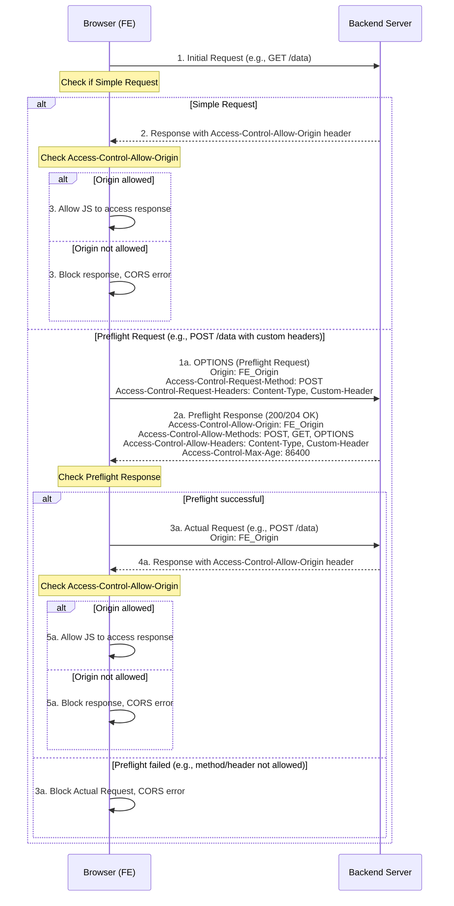

# 🛡️ Cross-Origin Resource Sharing (CORS) - Tổng Quan

---

## 📋 Table of Contents

- **1.** [CORS là gì?](#1-cors-la-gi)
- **2.** [Cơ chế Same-Origin Policy (SOP)](#2-co-che-same-origin-policy-sop)
- **3.** [Khi nào CORS xảy ra?](#3-khi-nao-cors-xay-ra)
- **4.** [Luồng hoạt động CORS](#4-luong-hoat-dong-cors)
    - **4.1** [Request Đơn giản (Simple Request)](#41-request-don-gian-simple-request)
    - **4.2** [Request Preflight (Preflight Request)](#42-request-preflight-preflight-request)
- **5.** [Các HTTP Headers quan trọng trong CORS](#5-cac-http-headers-quan-trong-trong-cors)
- **6.** [Xử lý phía Backend (Java Servlet Example)](#6-xu-ly-phia-backend-java-servlet-example)
    - **6.1** [Tạo CorsFilter](#61-tao-corsfilter)
    - **6.2** [Lưu ý về Access-Control-Allow-Credentials](#62-luu-y-ve-access-control-allow-credentials)
- **7.** [Lưu ý khi có Proxy/Load Balancer (HAProxy)](#7-luu-y-khi-co-proxyload-balancer-haproxy)
- **8.** [Một số câu hỏi nhanh về CORS](#8-mot-so-cau-hoi-nhanh-ve-cors)
- **9.** [Tổng kết](#9-tong-ket)
- **10.** [Sơ đồ luồng CORS chi tiết](#10-so-do-luong-cors-chi-tiet)
    

---

## 1. CORS là gì?

CORS (Cross-Origin Resource Sharing) là một cơ chế bảo mật do trình duyệt web thực thi, cho phép hoặc từ chối các yêu cầu HTTP từ một ứng dụng web chạy ở **một origin này** truy cập tài nguyên từ **một origin khác**.

> ✅ Nếu yêu cầu HTTP được tạo từ JavaScript (ví dụ: `XMLHttpRequest` hoặc `Fetch API`) và có đích đến là một **origin khác** với origin của trang web hiện tại → trình duyệt sẽ **kiểm tra cơ chế CORS trước khi gửi request chính thức** hoặc trước khi trả về phản hồi cho JavaScript.

**Expert Note:** CORS không phải là một phương pháp xác thực (authentication) hay ủy quyền (authorization). Nó chỉ đơn thuần là một cơ chế cho phép hoặc từ chối việc truy cập tài nguyên từ một origin khác. Việc xác thực người dùng và phân quyền truy cập tài nguyên vẫn phải được xử lý ở phía Backend của bạn.

---

## 2. Cơ chế Same-Origin Policy (SOP)

Để hiểu CORS, trước tiên bạn cần biết về **Same-Origin Policy (SOP)**. SOP là một cơ chế bảo mật cốt lõi trong các trình duyệt web, quy định rằng JavaScript chỉ có thể tương tác với các tài nguyên (ví dụ: dữ liệu, DOM của iframe) đến từ **cùng một origin** mà script đó được tải về.

**Origin** được định nghĩa là sự kết hợp của `scheme` (protocol), `domain` (hostname), và `port`.

- `scheme`: `http`, `https`
    
- `domain`: `example.com`, `api.example.com`
    
- `port`: `:80`, `:443`, `:8080`, `:3000`
    

**Ví dụ về các cặp Origin:**

| Origin A                        | Origin B                        | Same/Different | Lý do                                             |
| ------------------------------- | ------------------------------- | -------------- | ------------------------------------------------- |
| `http://example.com/page1.html` | `http://example.com/page2.html` | Same           | Cùng scheme, domain, port.                        |
| `http://example.com:80/`        | `http://example.com/`           | Same           | Port 80 là mặc định cho HTTP.                     |
| `http://example.com`            | `https://example.com`           | Different      | Khác scheme (`http` vs `https`).                  |
| `http://example.com`            | `http://api.example.com`        | Different      | Khác domain (`example.com` vs `api.example.com`). |
| `http://example.com:8080`       | `http://example.com:3000`       | Different      | Khác port.                                        |
| `http://example.com`            | `http://192.168.1.1`            | Different      | Khác domain (tên miền vs IP).                     |

**Mục đích của SOP:** Ngăn chặn các trang web độc hại đọc dữ liệu nhạy cảm từ các trang web khác mà người dùng đang truy cập (ví dụ: thông tin ngân hàng, phiên đăng nhập).

**Vai trò của CORS:** CORS là một "kẽ hở được kiểm soát" (controlled loophole) của SOP, cho phép các nhà phát triển định nghĩa rõ ràng những origin nào được phép truy cập tài nguyên của họ, mở rộng khả năng của web mà vẫn duy trì bảo mật.

---

## 3. Khi nào CORS xảy ra?

- CORS chỉ xảy ra khi một ứng dụng web (chạy JavaScript) cố gắng gửi yêu cầu HTTP đến một tài nguyên ở **khác origin** so với origin mà ứng dụng đó được tải về.
    
- CORS **chỉ được thực thi bởi trình duyệt web**.
    
    - Các công cụ như `curl`, Postman, Insomnia, hoặc các ứng dụng backend (server-to-server calls) **không bị ảnh hưởng** bởi CORS vì chúng không tuân theo Same-Origin Policy của trình duyệt. Chúng có thể gửi yêu cầu đến bất kỳ đâu mà không cần preflight hay kiểm tra CORS header.
        
- Các trường hợp khác origin kích hoạt CORS:
    
    - `http` ≠ `https` (khác scheme)
        
    - `example.com` ≠ `api.example.com` (khác subdomain)
        
    - `domain.com` ≠ `anotherdomain.com` (khác domain)
        
    - `:8080` ≠ `:3000` (khác port)
        

---

## 4. Luồng hoạt động CORS

Trình duyệt sẽ xử lý các yêu cầu cross-origin theo hai loại chính: Simple Request và Preflight Request.

### 4.1 Request Đơn giản (Simple Request)

Một request được coi là "đơn giản" nếu nó đáp ứng **tất cả** các điều kiện sau:

- Sử dụng một trong các phương thức HTTP: `GET`, `HEAD`, `POST`.
    
- Chỉ sử dụng các header được phép (safelisted headers) như:
    
    - `Accept`
        
    - `Accept-Language`
        
    - `Content-Language`
        
    - `Content-Type` (chỉ với các giá trị: `application/x-www-form-urlencoded`, `multipart/form-data`, hoặc `text/plain`).
        
    - `Range`
        
- Không sử dụng bất kỳ sự kiện trình nghe (event listeners) nào trên `XMLHttpRequestUpload` đối tượng được sử dụng để tải lên.
    
- Không sử dụng `ReadableStream` đối tượng trong yêu cầu.
    

**Luồng hoạt động:**

1. **Trình duyệt gửi Request Chính:** Trình duyệt sẽ **tự động đính kèm header `Origin:`** (chứa origin của trang web client) vào request chính và gửi nó đến server.
    
2. **Server xử lý và phản hồi:** Server Backend xử lý yêu cầu và, nếu muốn cho phép cross-origin, phải trả về response kèm theo header `Access-Control-Allow-Origin`.
    
    HTTP
    
    ```
    Access-Control-Allow-Origin: https://frontend.com
    ```
    
3. **Trình duyệt kiểm tra:** Trình duyệt kiểm tra giá trị của `Access-Control-Allow-Origin` so với `Origin` của trang web client.
    
    - Nếu khớp, hoặc nếu `Access-Control-Allow-Origin: *` (cho phép bất kỳ origin nào), trình duyệt sẽ cho phép JavaScript truy cập phản hồi.
        
    - Nếu không khớp, trình duyệt sẽ chặn phản hồi và báo lỗi CORS.
        

### 4.2 Request Preflight (Preflight Request)

Nếu một request **không đáp ứng các điều kiện của Simple Request** (ví dụ: sử dụng phương thức `PUT`/`DELETE`, hoặc sử dụng các custom header như `Authorization`, `X-Custom-Token`, hoặc `Content-Type: application/json`), trình duyệt sẽ thực hiện một "preflight request" trước.

**Luồng hoạt động:**

1. **Trình duyệt gửi Preflight Request (`OPTIONS`):** Trình duyệt gửi một request HTTP với phương thức `OPTIONS` đến URL đích. Request này sẽ kèm theo các header sau:
    
    - `Origin`: Origin của trang web client.
        
    - `Access-Control-Request-Method`: Phương thức HTTP mà request chính sẽ sử dụng (ví dụ: `POST`, `PUT`, `DELETE`).
        
    - `Access-Control-Request-Headers`: Danh sách các header không phải safelisted mà request chính sẽ gửi (ví dụ: `X-Custom-Token`, `Authorization`, `Content-Type`).
        
    
    HTTP
    
    ```
    // Ví dụ Preflight Request
    OPTIONS /api/data HTTP/1.1
    Host: backend.com
    Origin: https://frontend.com
    Access-Control-Request-Method: POST
    Access-Control-Request-Headers: Content-Type, Authorization, X-Custom-Token
    ```
    
2. **Server Backend phản hồi Preflight:** Server phải trả về phản hồi cho request `OPTIONS` này (thường là mã trạng thái `200 OK` hoặc `204 No Content`) kèm theo các CORS header cho biết các phương thức, header, và origin nào được phép.
    
    HTTP
    
    ```
    // Ví dụ Preflight Response từ Backend
    HTTP/1.1 200 OK
    Access-Control-Allow-Origin: https://frontend.com
    Access-Control-Allow-Methods: POST, GET, PUT, DELETE, OPTIONS
    Access-Control-Allow-Headers: Content-Type, Authorization, X-Custom-Token
    Access-Control-Max-Age: 86400 // Tùy chọn: Thời gian cache preflight response (giây)
    ```
    
3. **Trình duyệt kiểm tra Preflight Response:**
    
    - Nếu các header trong phản hồi của Preflight cho phép phương thức, các header tùy chỉnh và origin của request sắp tới, trình duyệt sẽ cho phép gửi **request chính thức**.
        
    - Nếu không, trình duyệt sẽ chặn request chính và báo lỗi CORS.
        
4. **Trình duyệt gửi Request Chính (nếu Preflight thành công):** Chỉ khi Preflight thành công, trình duyệt mới gửi request chính thức (ví dụ: `POST /api/data`) kèm theo header `Origin` của nó.
    
5. **Server Backend xử lý và phản hồi Request Chính:** Server xử lý request chính và trả về phản hồi bình thường, **cũng phải kèm theo header `Access-Control-Allow-Origin`** (giống như Simple Request).
    

**Expert Note:**

- **Performance:** Preflight request tạo thêm một round-trip mạng, có thể ảnh hưởng đến hiệu suất, đặc biệt là với các API được gọi thường xuyên. Header `Access-Control-Max-Age` có thể giúp giảm thiểu vấn đề này bằng cách cho phép trình duyệt cache kết quả preflight trong một khoảng thời gian nhất định, không cần gửi preflight lặp lại cho cùng một URL trong thời gian đó.
    
- **Client-side Logic:** Toàn bộ logic kiểm tra CORS (simple vs. preflight, kiểm tra header response) đều được xử lý tự động bởi trình duyệt. JavaScript của bạn không cần và không thể can thiệp trực tiếp vào quá trình này.
    

---

## 5. Các HTTP Headers quan trọng trong CORS

|Header (Client)|Header (Server)|Mô tả|
|---|---|---|
|`Origin`|`Access-Control-Allow-Origin`|**Client**: Origin của request.  <br>**Server**: Origin được phép truy cập tài nguyên. Có thể là một origin cụ thể hoặc `*` (cho phép tất cả - cẩn thận khi sử dụng).|
|`Access-Control-Request-Method`|`Access-Control-Allow-Methods`|**Client (Preflight)**: Phương thức HTTP sẽ được dùng cho request chính.  <br>**Server**: Các phương thức HTTP được phép.|
|`Access-Control-Request-Headers`|`Access-Control-Allow-Headers`|**Client (Preflight)**: Các header tùy chỉnh sẽ được dùng cho request chính.  <br>**Server**: Các header tùy chỉnh được phép.|
|`Cookie` (automatic)|`Access-Control-Allow-Credentials`|**Server**: Chỉ định liệu request có thể gửi kèm thông tin xác thực (cookies, HTTP authentication, client-side SSL certificates) hay không. Phải là `true` hoặc không có.|
|(Không có)|`Access-Control-Expose-Headers`|**Server**: Cho phép trình duyệt JavaScript truy cập các header tùy chỉnh ngoài các header mặc định (Cache-Control, Content-Language, Content-Type, Expires, Last-Modified, Pragma).|
|(Không có)|`Access-Control-Max-Age`|**Server**: Thời gian (giây) mà kết quả của preflight request có thể được cache bởi trình duyệt.|

---

## 6. Xử lý phía Backend (Java Servlet Example)

Để hỗ trợ CORS, Backend của bạn phải cấu hình để trả về các CORS header phù hợp. Trong môi trường Java Servlet, bạn có thể tạo một `Filter`.

### 6.1 Tạo `CorsFilter`

Java

```
import javax.servlet.*;
import javax.servlet.annotation.WebFilter;
import javax.servlet.http.HttpServletRequest;
import javax.servlet.http.HttpServletResponse;
import java.io.IOException;
import java.util.Arrays;
import java.util.List;

@WebFilter("/*") // Áp dụng filter cho tất cả các request
public class CorsFilter implements Filter {

    // Danh sách các origin được phép truy cập
    private static final List<String> ALLOWED_ORIGINS = Arrays.asList(
        "https://frontend.com", // Origin cụ thể của ứng dụng frontend
        "http://localhost:3000" // Hoặc localhost cho môi trường dev
    );

    @Override
    public void doFilter(ServletRequest req, ServletResponse res, FilterChain chain)
            throws IOException, ServletException {

        HttpServletRequest request = (HttpServletRequest) req;
        HttpServletResponse response = (HttpServletResponse) res;

        // Lấy Origin từ request header
        String origin = request.getHeader("Origin");

        // 1. Kiểm tra Origin có được phép không
        if (origin != null && ALLOWED_ORIGINS.contains(origin)) {
            // Đặt Access-Control-Allow-Origin
            response.setHeader("Access-Control-Allow-Origin", origin);

            // Cho phép credentials (cookies, HTTP auth)
            response.setHeader("Access-Control-Allow-Credentials", "true");
        } else {
            // Nếu origin không được phép, có thể không set header hoặc set một giá trị mặc định.
            // Để đơn giản, ví dụ này chỉ set nếu được phép.
        }

        // 2. Xử lý Preflight Request (OPTIONS)
        if ("OPTIONS".equalsIgnoreCase(request.getMethod())) {
            // Đặt các header cho Preflight response
            // Các phương thức HTTP được phép
            response.setHeader("Access-Control-Allow-Methods", "GET, POST, PUT, DELETE, OPTIONS, HEAD");
            // Các header tùy chỉnh được phép
            response.setHeader("Access-Control-Allow-Headers", "Content-Type, Authorization, X-Custom-Header, X-Requested-With");
            // Thời gian cache Preflight response (giây). 86400s = 24 giờ
            response.setHeader("Access-Control-Max-Age", "86400");

            // Trả về 200 OK hoặc 204 No Content cho Preflight request
            response.setStatus(HttpServletResponse.SC_OK); // 200 OK
            return; // Ngừng xử lý, không chuyển tiếp Preflight đến các Filter/Servlet khác
        }

        // 3. Chuyển tiếp request đến các Filter/Servlet tiếp theo trong chuỗi
        chain.doFilter(req, res);
    }

    @Override
    public void init(FilterConfig filterConfig) throws ServletException {
        // Khởi tạo filter (nếu cần)
    }

    @Override
    public void destroy() {
        // Dọn dẹp tài nguyên (nếu cần)
    }
}
```

**Expert Note:**

- **Wildcard `*`:** Tránh sử dụng `Access-Control-Allow-Origin: *` trong môi trường Production nếu bạn không thực sự muốn bất kỳ website nào cũng có thể truy cập API của mình. Nó có thể là một lỗ hổng bảo mật.
    
- **Dynamic Origin:** Nếu bạn có nhiều FE ứng dụng với các origin khác nhau, bạn có thể lấy `Origin` header từ request và kiểm tra xem nó có nằm trong danh sách các origin được phép của bạn không, sau đó trả lại chính `origin` đó trong `Access-Control-Allow-Origin`.
    

### 6.2 Lưu ý về `Access-Control-Allow-Credentials`

- Header này cho phép trình duyệt gửi và nhận cookies (bao gồm cả session cookies), HTTP Basic Authentication, và client-side SSL certificates trong các yêu cầu cross-origin.
    
- Nếu `Access-Control-Allow-Credentials` được đặt là `true`, thì bạn **không thể** sử dụng `Access-Control-Allow-Origin: *`. Bạn **phải** chỉ định một origin cụ thể trong `Access-Control-Allow-Origin`. Điều này là để tăng cường bảo mật, ngăn chặn các cuộc tấn công CSRF tiềm ẩn.
    
- Nếu ứng dụng Frontend của bạn cần gửi cookies (ví dụ để duy trì session) trong yêu cầu cross-origin, thì cả phía client (trong Fetch API hoặc XMLHttpRequest) và phía server đều phải cấu hình đúng.
    
    - **Client-side (Fetch API):** `fetch(url, { credentials: 'include' });`
        
    - **Client-side (XMLHttpRequest):** `xhr.withCredentials = true;`
        

---

## 7. Lưu ý khi có Proxy/Load Balancer (HAProxy)

Khi bạn có một Reverse Proxy hoặc Load Balancer (như HAProxy, Nginx, API Gateway) đứng trước Backend server, cần chú ý:

- **Cho phép OPTIONS:** Load Balancer/Proxy phải được cấu hình để cho phép các request `OPTIONS` đi qua và chuyển tiếp chúng đến Backend. Một số proxy có thể chặn hoặc xử lý `OPTIONS` request một cách mặc định.
    
- **Không strip header:** Đảm bảo Proxy/Load Balancer không loại bỏ (strip) các header CORS quan trọng (như `Origin`, `Access-Control-Request-Method`, `Access-Control-Request-Headers` từ request đến Backend, và các `Access-Control-Allow-*` header từ response của Backend đến trình duyệt).
    
- **Forwarding headers:** Đảm bảo các header liên quan đến CORS được chuyển tiếp một cách chính xác giữa client, proxy và backend.
    

**Expert Advice:** Trong một số kiến trúc microservices hoặc khi sử dụng API Gateway, bạn có thể cân nhắc xử lý CORS trực tiếp tại API Gateway (ví dụ: Spring Cloud Gateway, Zuul, Kong) thay vì tại mỗi microservice backend. Điều này giúp tập trung quản lý CORS và tránh cấu hình lặp lại.

---

## 8. Một số câu hỏi nhanh về CORS

|Câu hỏi|Trả lời|
|---|---|
|Có phải API gọi 2 lần không?|✅ **Đúng**, nếu là Preflight Request (ví dụ: `PUT`, `DELETE`, hoặc dùng custom header), trình duyệt sẽ gửi `OPTIONS` trước, rồi mới gửi request thật.|
|Nếu không set `Access-Control-Allow-Headers` thì sao?|❌ Nếu Frontend gửi custom header (ví dụ `Authorization`) mà Backend không trả về trong `Access-Control-Allow-Headers`, request chính sẽ bị trình duyệt chặn.|
|Trả mã `202` cho preflight được không?|⚠️ Được, nhưng nên dùng `200 OK` hoặc `204 No Content` cho đúng chuẩn và để trình duyệt hiểu rõ hơn ý định.|
|CORS có phải là xác thực không?|❌ **Không**, CORS chỉ là cơ chế **kiểm tra quyền truy cập tài nguyên từ một origin khác**. Nó không liên quan đến việc xác định danh tính người dùng hay quyền của họ.|
|Tại sao Postman không bị lỗi CORS?|💡 Vì Postman không phải là trình duyệt web, nó không tuân theo Same-Origin Policy hay cơ chế CORS.|

---

## 9. Tổng kết

> CORS là một lớp bảo vệ an ninh quan trọng được thực thi bởi **trình duyệt web**, nhằm ngăn chặn các ứng dụng JavaScript truy cập trái phép tài nguyên từ các origin khác. Để một yêu cầu cross-origin thành công, server Backend phải phản hồi đúng các HTTP header CORS để "cho phép" trình duyệt tiếp tục gửi hoặc xử lý request chính. Việc hiểu và cấu hình CORS chính xác là cần thiết cho các ứng dụng web hiện đại.

---

## 10. Sơ đồ luồng CORS chi tiết

Đoạn mã



---

> **Lưu ý**: Copy toàn bộ nội dung vào tệp `Cơ chế CORS.md` và mở bằng VS Code, Obsidian hoặc trình soạn thảo ưa thích để tải và tiếp tục chỉnh sửa.
